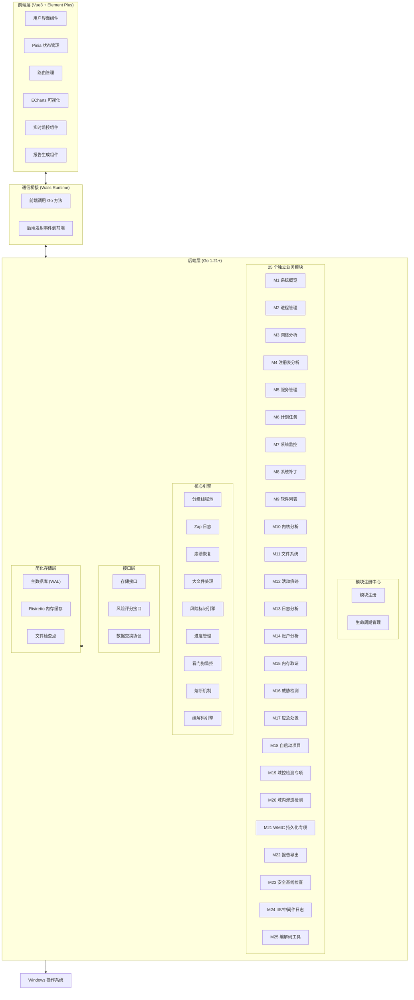
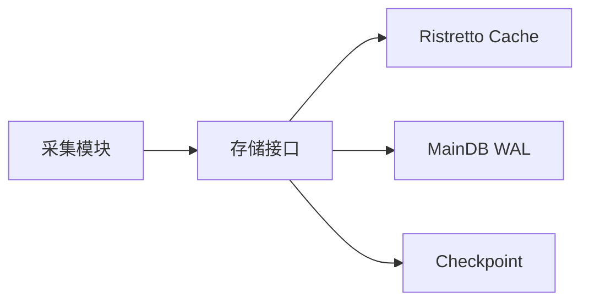
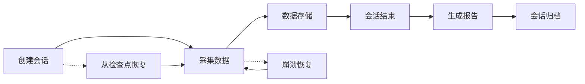

# Windows 应急响应工具 (ERT) 技术设计方案

需求名称：2026-03-25-windows-ert
更新日期：2026-03-25

## 概述

Windows 应急响应工具 (ERT) 是一款基于 Go 语言开发的 Windows 系统应急响应工具，采用 Wails v2 + Vue3 + Element Plus 前后端分离架构，支持 **25 个独立功能模块**。核心数据存储采用 SQLite 简化架构（MainDB + Cache + Checkpoint），默认只读采集，支持可选的安全处置功能。

### 25 个模块概览

| ID | 模块名称 | 核心功能 | 优先级 |
|----|----------|----------|--------|
| M1 | 系统概览 | 主机信息、资源监控、实时图表 | P0 |
| M2 | 进程管理 | 进程列表/树、查杀、Dump | P0 |
| M3 | 网络分析 | 连接列表、端口监听、IP 地理 | P0 |
| M4 | 注册表分析 | 关键项检测、持久化、自启动 | P0 |
| M5 | 服务管理 | 服务列表、启停操作 | P0 |
| M6 | 计划任务 | 任务列表、异常检测 | P0 |
| M7 | 系统监控 | CPU/内存/磁盘/网络实时监控 | P0 |
| M8 | 系统补丁 | 已安装补丁、缺失补丁 | P1 |
| M9 | 软件列表 | 已安装软件、异常检测 | P0 |
| M10 | 内核分析 | 驱动列表、签名状态 | P1 |
| M11 | 文件系统 | 文件枚举、哈希、大文件处理 | P0 |
| M12 | 活动痕迹 | 最近打开、USB使用、浏览器历史 | P0 |
| M13 | 日志分析 | 事件日志、EVTX解析、全文搜索 | P0 |
| M14 | 账户分析 | 本地/域账户、组、权限 | P0 |
| M15 | 内存取证 | 进程/系统内存 Dump | P1 |
| M16 | 威胁检测 | 恶意进程、可疑网络、敏感行为 | P0 |
| M17 | 应急处置 | 进程查杀、文件隔离、审计日志 | P1 |
| M18 | 自启动项目 | 注册表/启动文件夹/服务/WMI | P0 |
| M19 | 域控检测专项 | 域用户/组/OU/GPO、离线降级 | P0 |
| M20 | 域内渗透检测 | Kerberoasting、Golden Ticket | P0 |
| M21 | WMIC 持久化专项 | WMIC 命令历史检测 | P0 |
| M22 | 报告导出 | HTML/PDF/JSON 导出 | P0 |
| M23 | 安全基线检查 | 密码/账户/审核/网络安全 | P0 |
| M24 | IIS/中间件日志 | IIS/Apache/SQL Server 日志 | P0 |
| M25 | 编解码工具 | Base64/Hex/Unicode/URL/HTML | P0 |

### 技术栈概览

| 层级 | 技术选型 | 版本 |
|------|----------|------|
| 后端框架 | Wails v2 | v2.7+ |
| 后端语言 | Go | 1.21+ |
| 前端框架 | Vue.js | 3.4+ |
| UI 组件库 | Element Plus | 2.4+ |
| 状态管理 | Pinia | 2.1+ |
| 图表库 | ECharts | 5.4+ |
| 数据库 | SQLite (modernc.org/sqlite 纯 Go) | v1.30+ |
| 缓存 | Ristretto | v0.2.0 |
| 日志 | Zap | v1.27+ |

---

## 架构设计

### 整体架构



### 项目目录结构

```
ert/
├── app/                      # 前端源码 (Vue3)
│   ├── src/
│   │   ├── components/       # 公共 UI 组件
│   │   │   ├── Progress/    # 进度显示组件
│   │   │   ├── RiskTag/     # 风险标记组件
│   │   │   ├── Search/      # 搜索组件
│   │   │   ├── Timeline/    # 攻击时间线组件
│   │   │   ├── Codec/       # 编解码工具组件 (M25)
│   │   │   └── Compare/     # 会话对比组件
│   │   ├── views/           # 25 个模块独立视图
│   │   ├── stores/          # 25 个独立 Pinia Store
│   │   ├── router/          # 路由配置
│   │   └── shortcuts/       # 快捷键管理
│   └── package.json
├── internal/                 # 后端内部包
│   ├── modules/              # 25 个独立模块
│   │   ├── system/          # M1 系统概览
│   │   ├── process/         # M2 进程管理
│   │   ├── network/         # M3 网络分析
│   │   ├── registry/        # M4 注册表分析
│   │   ├── service/         # M5 服务管理
│   │   ├── schedule/        # M6 计划任务
│   │   ├── monitor/         # M7 系统监控
│   │   ├── patch/           # M8 系统补丁
│   │   ├── software/        # M9 软件列表
│   │   ├── kernel/          # M10 内核分析
│   │   ├── filesystem/      # M11 文件系统
│   │   ├── activity/        # M12 活动痕迹
│   │   ├── logging/         # M13 日志分析
│   │   ├── account/         # M14 账户分析
│   │   ├── memory/          # M15 内存取证
│   │   ├── threat/          # M16 威胁检测
│   │   ├── response/        # M17 应急处置
│   │   ├── autostart/       # M18 自启动项目
│   │   ├── domain/          # M19 域控检测专项
│   │   ├── domainhack/      # M20 域内渗透检测
│   │   ├── wmic/            # M21 WMIC 持久化专项
│   │   ├── report/          # M22 报告导出
│   │   ├── baseline/        # M23 安全基线检查
│   │   ├── iis/             # M24 IIS/中间件日志
│   │   └── codec/           # M25 编解码工具
│   ├── core/                 # 核心引擎
│   │   ├── storage/         # SQLite 存储管理
│   │   ├── cache/           # Ristretto 缓存
│   │   ├── checkpoint/      # 文件检查点
│   │   ├── concurrency/     # 分级线程池
│   │   ├── recovery/        # 崩溃恢复
│   │   ├── watchdog/        # 看门狗监控
│   │   ├── circuit/         # 熔断机制
│   │   ├── risk/            # 风险标记引擎
│   │   ├── progress/        # 进度管理
│   │   ├── timeline/        # 攻击时间线重建
│   │   ├── compare/         # 会话对比
│   │   ├── aging/           # 任务老化机制
│   │   ├── codec/           # 编解码引擎
│   │   └── memory/          # 内存 Dump 引擎
│   ├── startup/             # 启动检测
│   │   ├── webview2/        # WebView2 检测
│   │   └── permission/      # 权限检测
│   ├── registry/             # 模块注册中心
│   ├── interfaces/           # 接口定义
│   ├── dto/                 # 数据交换协议
│   └── model/               # 数据结构
├── config/
│   └── config.yaml          # 中心化配置
├── data/
│   ├── ipdb/                # IP 地理位置库
│   ├── baseline/            # 基线配置
│   └── memory/              # 内存 dump 文件
├── wails.json               # Wails 配置
├── go.mod
└── go.sum
```

---

## 核心引擎设计

### 1. SQLite 简化存储架构

采用 MainDB + Cache + Checkpoint 三库架构，使用 `modernc.org/sqlite` 纯 Go 驱动：



**MainDB (WAL 模式)**
- 使用 modernc.org/sqlite 纯 Go 实现，无 CGO 依赖
- WAL 模式支持并发读写
- 批量写入：减少锁竞争
- 定期 checkpoint：控制 WAL 文件大小

**Ristretto 缓存**
- 高性能内存缓存
- TTL 支持
- LRU 淘汰策略

**Checkpoint**
- 崩溃恢复点
- 原子写入 + 版本号校验
- 会话状态持久化

### 2. 分级并发线程池

```go
type SemaphorePool struct {
    high    semaphore.Weighted  // P0 任务
    medium  semaphore.Weighted  // P1 任务
    low     semaphore.Weighted  // P2 任务
}

type Task struct {
    ID       string
    Priority int
    Handler  func() error
    CreatedAt time.Time
}
```

**优先级调度**
- P0: 系统关键任务 (进程采集、网络分析)
- P1: 一般采集任务 (日志分析、文件枚举)
- P2: 低优先级任务 (基线检查、报告生成)

### 3. 任务老化机制

防止低优先级任务饿死：

```go
type AgingController struct {
    MaxWaitTime   time.Duration
    PriorityBoost int
    CheckInterval time.Duration
}
```

- 等待超过阈值时提升优先级
- 超过最大等待时间强制执行
- 动态调整防止饥饿

### 4. 熔断与看门狗

```go
type CircuitBreaker struct {
    failureThreshold int
    resetTimeout     time.Duration
    state            atomic.Int32
}

type Watchdog struct {
    timeout    time.Duration
    onTimeout  func(taskID string)
}
```

- 连续失败 N 次后暂停任务
- 独立 Goroutine 监控任务执行
- 超时自动取消

### 5. 编解码引擎 (M25)

```go
type CodecEngine struct {
    HistoryDB *sql.DB
    MaxHistory int
    EnableHistory bool  // 默认开启
}

type CodecType string
const (
    CodecBase64     CodecType = "base64"
    CodecBase64URL  CodecType = "base64url"
    CodecHex        CodecType = "hex"
    CodecUnicode    CodecType = "unicode"
    CodecURL        CodecType = "url"
    CodecHTML       CodecType = "html"
    CodecBinary     CodecType = "binary"
)
```

**支持类型**
| 编码类型 | 编码示例 | 解码示例 |
|----------|----------|----------|
| Base64 | `SGVsbG8=` | `Hello` |
| Hex | `48656c6c6f` | `Hello` |
| Unicode | `\u0048\u0065` | `He` |
| URL | `%48%65` | `He` |
| HTML | `&#72;&#101;` | `He` |
| Binary | `01001000` | `H` |

**历史记录特性**
- 历史记录默认开启
- 历史记录存储在 SQLite 数据库
- 支持配置最大历史条数（默认 100 条）
- 支持配置历史保留天数（默认 7 天）
- 不发送任何网络请求
- 处理完成后内存立即清零

**M25 数据库表结构**

```sql
-- 编解码历史记录表
CREATE TABLE codec_history (
    id INTEGER PRIMARY KEY AUTOINCREMENT,
    input TEXT NOT NULL,
    output TEXT NOT NULL,
    codec_type TEXT NOT NULL,
    operation TEXT NOT NULL,
    created_at TEXT NOT NULL
);

CREATE INDEX idx_codec_history_created ON codec_history(created_at);
CREATE INDEX idx_codec_history_type ON codec_history(codec_type);
```

### 6. 内存 Dump 引擎

支持进程和系统内存 dump 用于取证分析：

```go
type MemoryDumper struct {
    outputDir string
    maxSize   uint64
}

type DumpType string
const (
    DumpProcess  DumpType = "process"
    DumpFull     DumpType = "full"
    DumpKernel   DumpType = "kernel"
)

func (m *MemoryDumper) DumpProcess(pid uint32) (string, error)
func (m *MemoryDumper) DumpFull() (string, error)
```

**安全特性**
- 只读采集，不修改系统状态
- 支持分块写入，避免内存溢出
- 记录 dump 过程的审计日志
- 生成 SHA256 哈希校验完整性

---

## 25 个独立模块详细设计

### 模块设计原则

每个模块遵循以下设计原则：
- **职责单一**：每个模块只负责特定的功能领域
- **接口驱动**：模块通过接口与核心引擎交互
- **配置独立**：每个模块有独立的采集配置
- **数据隔离**：模块数据通过 DTO 传输，不直接操作数据库表
- **启动加载**：模块在程序启动时注册，不支持运行时热插拔

### M1 系统概览

**功能定位**：展示主机基本信息和关键指标的总览面板

**核心功能**：
| 功能 | 说明 | 优先级 |
|------|------|--------|
| 主机基本信息 | 计算机名、操作系统版本、当前用户、启动时间 | P0 |
| 系统资源 | CPU 使用率、内存使用率、磁盘使用率 | P0 |
| 网络状态 | 网卡信息、IP 地址、网络连接数 | P0 |
| 运行时间 | 系统运行时间、最后一次启动时间 | P1 |
| 关键进程数 | 进程总数、线程总数、句柄总数 | P1 |
| 实时监控图表 | CPU/内存/磁盘/网络实时曲线图 | P0 |

**数据来源**：
- Windows API: `GetSystemInfo`, `GlobalMemoryStatusEx`
- WMI: `Win32_OperatingSystem`, `Win32_ComputerSystem`
- `github.com/shirou/gopsutil`

**UI 展示**：
- 卡片式布局展示各项指标
- ECharts 实时图表
- 风险状态概览

---

### M2 进程管理

**功能定位**：进程查看、分析、处置

**核心功能**：
| 功能 | 说明 | 优先级 |
|------|------|--------|
| 进程列表 | PID、名称、路径、用户、CPU、内存、启动时间 | P0 |
| 进程树 | 父子进程关系树形展示 | P0 |
| 进程详情 | 命令行、环境变量、加载模块、线程信息 | P1 |
| 进程搜索 | 按名称/PID/路径搜索 | P0 |
| 风险标记 | 无签名标黄，可疑进程标红 | P0 |
| 进程查杀 | 终止进程（需管理员+二次确认） | P1 |
| 进程 Dump | 导出进程内存用于分析 | P1 |

**数据来源**：
- Windows API: `NtQuerySystemInformation`, `EnumProcesses`
- WMI: `Win32_Process`
- `github.com/shirou/gopsutil`

**SQLite 存储**：
```sql
INSERT INTO processes (pid, name, path, command_line, user_name, 
    cpu_percent, memory_bytes, start_time, risk_level, collected_at, session_id)
VALUES (?, ?, ?, ?, ?, ?, ?, ?, ?, ?, ?)
```

**安全机制**：
- 进程查杀需二次确认
- 关键系统进程（lsass.exe, winlogon.exe）禁止查杀
- 所有操作记录审计日志

---

### M3 网络分析

**功能定位**：网络连接查看、异常检测

**核心功能**：
| 功能 | 说明 | 优先级 |
|------|------|--------|
| 连接列表 | 协议、本地地址/端口、远程地址/端口、状态、PID | P0 |
| 监听端口 | 所有监听中的端口及对应进程 | P0 |
| 网络路径 | 路由表、ARP 表 | P1 |
| IP 地理位置 | 显示远程 IP 的地理位置 | P1 |
| 风险检测 | 可疑端口、可疑外部连接 | P0 |
| 连接统计 | 按协议/状态分组统计 | P1 |

**数据来源**：
- Windows API: `GetExtendedTcpTable`, `GetExtendedUdpTable`
- `github.com/shirou/gopsutil`

**SQLite 存储**：
```sql
INSERT INTO network_connections (pid, protocol, local_addr, local_port, 
    remote_addr, remote_port, state, risk_level, collected_at, session_id)
VALUES (?, ?, ?, ?, ?, ?, ?, ?, ?, ?)
```

**IP 库**：
- 使用精简离线 IP 库（<20MB）
- 支持 MaxMind GeoIP2 格式
- 查询 `github.com/oschwald/geoip2-golang`

---

### M4 注册表分析

**功能定位**：注册表关键项检测、持久化分析

**核心功能**：
| 功能 | 说明 | 优先级 |
|------|------|--------|
| 关键项检测 | Run、RunOnce、Services 等关键路径 | P0 |
| 自启动项 | 注册表中的自启动项 | P0 |
| 最近操作 | 最近打开/编辑的注册表项 | P1 |
| 权限分析 | 注册表项的访问权限 | P2 |
| 值类型分析 | 可疑的值类型（如 REG_BINARY 解码） | P1 |
| 注册表搜索 | 按路径/名称/值搜索 | P0 |

**重点检测路径**：
```
HKLM\SOFTWARE\Microsoft\Windows\CurrentVersion\Run
HKLM\SOFTWARE\Microsoft\Windows\CurrentVersion\RunOnce
HKLM\SYSTEM\CurrentControlSet\Services
HKCU\SOFTWARE\Microsoft\Windows\CurrentVersion\Run
HKCU\SOFTWARE\Microsoft\Windows\CurrentVersion\Explorer\RunMRU
```

**数据来源**：
- Windows API: `RegOpenKeyEx`, `RegEnumKeyEx`
- `golang.org/x/sys/windows/registry`

**SQLite 存储**：
```sql
INSERT INTO registry_keys (path, name, value_type, value, 
    modified_time, risk_level, collected_at, session_id)
VALUES (?, ?, ?, ?, ?, ?, ?, ?)
```

---

### M5 服务管理

**功能定位**：Windows 服务查看、分析

**核心功能**：
| 功能 | 说明 | 优先级 |
|------|------|--------|
| 服务列表 | 名称、显示名、状态、启动类型、路径 | P0 |
| 服务详情 | 依赖关系、描述、触发条件 | P1 |
| 风险检测 | 异常服务、禁用安全服务 | P0 |
| 服务搜索 | 按名称/状态/启动类型搜索 | P0 |
| 服务操作 | 启动/停止/重启（需管理员+二次确认） | P1 |

**数据来源**：
- Windows API: `EnumServicesStatusEx`
- WMI: `Win32_Service`
- `github.com/shirou/gopsutil`

**SQLite 存储**：
```sql
INSERT INTO services (name, display_name, status, start_type, 
    path, risk_level, collected_at, session_id)
VALUES (?, ?, ?, ?, ?, ?, ?, ?)
```

---

### M6 计划任务

**功能定位**：计划任务查看、持久化检测

**核心功能**：
| 功能 | 说明 | 优先级 |
|------|------|--------|
| 任务列表 | 任务名称、状态、上次运行、下次运行 | P0 |
| 任务详情 | 操作、触发器、运行条件 | P1 |
| 异常检测 | 隐藏任务、异常路径任务 | P0 |
| 任务操作 | 创建/删除/修改任务（需管理员+二次确认） | P2 |
| XML 导出 | 导出任务配置用于分析 | P1 |

**数据来源**：
- Windows API: `ITaskScheduler`, `IScheduledWorkItem`
- `github.com/go-ole/go-ole` (COM 接口)
- WMI: `Win32_ScheduledTask`

**SQLite 存储**：
```sql
INSERT INTO scheduled_tasks (name, path, state, last_run_time, 
    next_run_time, risk_level, collected_at, session_id)
VALUES (?, ?, ?, ?, ?, ?, ?, ?)
```

---

### M7 系统监控

**功能定位**：实时系统状态监控、告警

**核心功能**：
| 功能 | 说明 | 优先级 |
|------|------|--------|
| CPU 监控 | 使用率实时曲线、历史峰值 | P0 |
| 内存监控 | 使用量/总量、换页率 | P0 |
| 磁盘监控 | 读写速度、空间使用 | P0 |
| 网络监控 | 流量实时曲线 | P0 |
| 进程活动 | 新进程创建、进程退出 | P1 |
| 连接监控 | 新建连接、连接关闭 | P1 |
| 告警规则 | 自定义阈值告警 | P2 |

**实现方式**：
- 独立 Goroutine 定期采集（默认 1 秒间隔）
- 通过 Wails `Emit` 推送实时数据到前端
- ECharts 绑定实时数据流

**告警规则引擎设计**：

```go
type AlertRule struct {
    ID          string      `json:"id"`
    Name        string      `json:"name"`
    ModuleID    int         `json:"module_id"`     // 关联模块
    Condition   AlertCondition `json:"condition"`   // 触发条件
    Threshold  float64     `json:"threshold"`      // 阈值
    Duration    time.Duration `json:"duration"`      // 持续时间
    Severity    RiskLevel   `json:"severity"`      // 严重程度
    Enabled     bool        `json:"enabled"`
    Actions     []AlertAction `json:"actions"`     // 触发动作
}

type AlertCondition int
const (
    ConditionGreater   AlertCondition = 0  // 大于
    ConditionLess      AlertCondition = 1  // 小于
    ConditionEqual     AlertCondition = 2  // 等于
    ConditionContains  AlertCondition = 3  // 包含
    ConditionMatch     AlertCondition = 4  // 正则匹配
)

type AlertAction int
const (
    ActionLog       AlertAction = 0  // 记录日志
    ActionNotify    AlertAction = 1  // 前端通知
    ActionSound     AlertAction = 2  // 声音提醒
    ActionExecute   AlertAction = 3  // 执行命令
)

type AlertEvent struct {
    ID        string    `json:"id"`
    RuleID    string    `json:"rule_id"`
    RuleName  string    `json:"rule_name"`
    Severity  RiskLevel `json:"severity"`
    Message   string    `json:"message"`
    Value     float64   `json:"value"`      // 触发时的值
    Threshold float64   `json:"threshold"`   // 阈值
    Timestamp time.Time `json:"timestamp"`
    ModuleID  int       `json:"module_id"`
    SessionID string    `json:"session_id"`
}
```

**告警引擎核心逻辑**：

```go
type AlertEngine struct {
    rules     map[string]*AlertRule
    history   *ristretto.Cache
    notifier  *Notifier
    evaluator *Evaluator
}

func (ae *AlertEngine) Evaluate(moduleID int, data map[string]interface{}) {
    for _, rule := range ae.rules {
        if rule.ModuleID != moduleID || !rule.Enabled {
            continue
        }
        
        select {
        case <-time.After(rule.Duration):
            value, ok := ae.getMetricValue(data, rule.Condition.Metric)
            if !ok {
                continue
            }
            
            if ae.checkCondition(value, rule.Condition, rule.Threshold) {
                ae.trigger(rule, value)
            }
        default:
            // 超时检查
        }
    }
}

func (ae *AlertEngine) checkCondition(value float64, cond AlertCondition, threshold float64) bool {
    switch cond {
    case ConditionGreater:
        return value > threshold
    case ConditionLess:
        return value < threshold
    case ConditionEqual:
        return value == threshold
    case ConditionContains:
        return strings.Contains(fmt.Sprintf("%f", value), fmt.Sprintf("%f", threshold))
    case ConditionMatch:
        re := regexp.MustCompile(fmt.Sprintf("%f", threshold))
        return re.MatchString(fmt.Sprintf("%f", value))
    }
    return false
}
```

**内置告警规则模板**：

```yaml
alert_rules:
  # 系统资源告警
  - id: "cpu_high"
    name: "CPU 使用率过高"
    module_id: 7
    condition:
      metric: "cpu_percent"
      type: greater
    threshold: 90
    duration: 30s
    severity: high
    enabled: true
    actions: [log, notify]
    
  - id: "memory_high"
    name: "内存使用率过高"
    module_id: 7
    condition:
      metric: "memory_percent"
      type: greater
    threshold: 85
    duration: 30s
    severity: high
    enabled: true
    actions: [log, notify]
    
  - id: "disk_high"
    name: "磁盘使用率过高"
    module_id: 7
    condition:
      metric: "disk_percent"
      type: greater
    threshold: 90
    duration: 1m
    severity: medium
    enabled: true
    actions: [log]
    
  # 进程告警
  - id: "new_suspicious_process"
    name: "发现可疑新进程"
    module_id: 2
    condition:
      metric: "process.name"
      type: match
    threshold: "(cmd|powershell|wscript|cscript).*\.tmp"
    duration: 0s
    severity: high
    enabled: true
    actions: [log, notify, sound]
    
  # 网络告警
  - id: "external_connection"
    name: "可疑外部连接"
    module_id: 3
    condition:
      metric: "network.remote_addr"
      type: match
    threshold: "(192\.168\.|10\.|172\.(1[6-9]|2[0-9]|3[01])\.)"
    duration: 0s
    severity: medium
    enabled: true
    actions: [log]
    
  - id: "unusual_port"
    name: "异常端口监听"
    module_id: 3
    condition:
      metric: "network.local_port"
      type: match
    threshold: "(4444|5555|6666|7777|8888|9999)"
    duration: 0s
    severity: high
    enabled: true
    actions: [log, notify]
    
  # 安全事件告警
  - id: "login_failure"
    name: "登录失败"
    module_id: 13
    condition:
      metric: "event.event_id"
      type: equal
    threshold: 4625
    duration: 0s
    severity: medium
    enabled: true
    actions: [log]
    
  - id: "admin_login"
    name: "管理员登录"
    module_id: 13
    condition:
      metric: "event.event_id"
      type: equal
    threshold: 4672
    duration: 0s
    severity: high
    enabled: true
    actions: [log, notify]
    
  - id: "process_creation"
    name: "可疑进程创建"
    module_id: 13
    condition:
      metric: "event.event_id"
      type: equal
    threshold: 4688
    duration: 0s
    severity: medium
    enabled: true
    actions: [log]
```

**告警 SQLite 存储**：

```sql
CREATE TABLE alert_rules (
    id TEXT PRIMARY KEY,
    name TEXT NOT NULL,
    module_id INTEGER NOT NULL,
    condition_type INTEGER NOT NULL,
    condition_metric TEXT NOT NULL,
    threshold REAL NOT NULL,
    duration INTEGER NOT NULL,
    severity INTEGER NOT NULL,
    enabled INTEGER DEFAULT 1,
    actions TEXT NOT NULL,
    created_at TEXT NOT NULL
);

CREATE TABLE alert_events (
    id TEXT PRIMARY KEY,
    rule_id TEXT NOT NULL,
    rule_name TEXT NOT NULL,
    severity INTEGER NOT NULL,
    message TEXT NOT NULL,
    value REAL,
    threshold REAL,
    timestamp TEXT NOT NULL,
    module_id INTEGER NOT NULL,
    session_id TEXT NOT NULL,
    acknowledged INTEGER DEFAULT 0,
    acknowledged_by TEXT,
    acknowledged_at TEXT,
    FOREIGN KEY (rule_id) REFERENCES alert_rules(id)
);

CREATE INDEX idx_alert_events_timestamp ON alert_events(timestamp);
CREATE INDEX idx_alert_events_severity ON alert_events(severity);
CREATE INDEX idx_alert_events_session ON alert_events(session_id);
```

**告警配置项**：

```yaml
monitor:
  interval: 1s        # 采集间隔
  history_size: 300    # 历史数据点数量
  alerts:
    cpu_threshold: 90  # CPU 告警阈值
    mem_threshold: 85  # 内存告警阈值
    disk_threshold: 90  # 磁盘告警阈值
    
alerting:
  enabled: true
  max_events: 1000       # 内存中最大告警事件数
  retention_days: 30      # 告警事件保留天数
  notification:
    sound: true
    popup: true
  ```

---

### M8 系统补丁

**功能定位**：系统补丁查看、漏洞检测

**核心功能**：
| 功能 | 说明 | 优先级 |
|------|------|--------|
| 已安装补丁 | KB 编号、描述、安装日期 | P0 |
| 缺失补丁 | 已知的重要的安全补丁 | P1 |
| 漏洞关联 | 补丁对应的 CVE 漏洞 | P2 |
| 补丁搜索 | 按 KB 编号/日期搜索 | P1 |

**数据来源**：
- WMI: `Win32_QuickFixEngineering`
- Windows API: `QueryHotfix`

**SQLite 存储**：
```sql
CREATE TABLE patches (
    id INTEGER PRIMARY KEY AUTOINCREMENT,
    hotfix_id TEXT NOT NULL,
    description TEXT,
    installed_on TEXT,
    risk_level INTEGER DEFAULT 0,
    collected_at TEXT NOT NULL,
    session_id TEXT NOT NULL
);
```

---

### M9 软件列表

**功能定位**：已安装软件查看、异常检测

**核心功能**：
| 功能 | 说明 | 优先级 |
|------|------|--------|
| 软件列表 | 名称、版本、发布者、安装日期 | P0 |
| 安装位置 | 软件安装路径 | P1 |
| 异常检测 | 可疑软件、无版本软件 | P1 |
| 软件搜索 | 按名称/发布者搜索 | P0 |
| 卸载检测 | 可疑的卸载程序 | P2 |

**数据来源**：
- 注册表: `HKLM\SOFTWARE\Microsoft\Windows\CurrentVersion\Uninstall`
- `github.com/shirou/gopsutil`

**SQLite 存储**：
```sql
CREATE TABLE software (
    id INTEGER PRIMARY KEY AUTOINCREMENT,
    name TEXT NOT NULL,
    version TEXT,
    publisher TEXT,
    install_date TEXT,
    install_location TEXT,
    risk_level INTEGER DEFAULT 0,
    collected_at TEXT NOT NULL,
    session_id TEXT NOT NULL
);
```

---

### M10 内核分析

**功能定位**：内核对象查看（用户态降级）

**核心功能**：
| 功能 | 说明 | 优先级 |
|------|------|--------|
| SSDT 查看 | 系统服务描述符表 | P1 |
| 驱动列表 | 已加载内核驱动 | P0 |
| 驱动签名 | 驱动签名状态 | P0 |
| 异常驱动 | 无签名驱动、签名无效驱动 | P1 |

**数据来源**：
- Windows API: `NtQuerySystemInformation`
- `github.com/shirou/gopsutil`

**说明**：用户态程序无法直接访问内核内存，仅能获取驱动列表和签名状态。深度内核分析需要内核驱动支持。

**SQLite 存储**：
```sql
CREATE TABLE drivers (
    id INTEGER PRIMARY KEY AUTOINCREMENT,
    name TEXT NOT NULL,
    path TEXT,
    base_address TEXT,
    size INTEGER,
    is_signed INTEGER DEFAULT 0,
    signature TEXT,
    risk_level INTEGER DEFAULT 0,
    collected_at TEXT NOT NULL,
    session_id TEXT NOT NULL
);
```

---

### M11 文件系统

**功能定位**：文件分析、取证

**核心功能**：
| 功能 | 说明 | 优先级 |
|------|------|--------|
| 文件枚举 | 目录浏览、文件列表 | P0 |
| 文件详情 | 大小、创建/修改/访问时间、属性 | P0 |
| 文件搜索 | 按名称/大小/日期范围搜索 | P0 |
| 文件哈希 | MD5、SHA1、SHA256 计算 | P0 |
| 可疑文件 | 隐藏文件、系统文件、异常扩展名 | P1 |
| 文件复制 | 复制文件到指定位置（只读） | P1 |
| 大文件处理 | GB 级文件流式读取 | P0 |

**数据来源**：
- Windows API: `FindFirstFile`, `FindNextFile`
- `golang.org/x/sys/windows`

**大文件处理**：
```go
func streamHash(ctx context.Context, filePath string, hasher hash.Hash) error {
    f, err := os.Open(filePath)
    if err != nil {
        return err
    }
    defer f.Close()

    buf := make([]byte, 32*1024)
    for {
        select {
        case <-ctx.Done():
            return ctx.Err()
        default:
            n, err := io.ReadFull(f, buf)
            if n > 0 {
                hasher.Write(buf[:n])
            }
            if err == io.EOF {
                return nil
            }
            if err != nil {
                return err
            }
        }
    }
}
```

---

### M12 活动痕迹

**功能定位**：用户操作痕迹检测

**核心功能**：
| 功能 | 说明 | 优先级 |
|------|------|--------|
| 最近打开 | 最近打开的文档、程序 | P0 |
| USB 使用 | USB 设备使用记录 | P1 |
| 网络浏览 | 浏览器历史记录（Chrome、Firefox、Edge） | P1 |
| 文件操作 | 文件创建、修改、删除记录 | P1 |
| 应用执行 | 应用执行历史 | P0 |
| 回收站 | 回收站内容 | P2 |

**数据来源**：
- 跳转列表: `%APPDATA%\Microsoft\Windows\Recent`
- 注册表: `HKCU\SOFTWARE\Microsoft\Windows\CurrentVersion\Explorer\RunMRU`
- 浏览器数据库: SQLite 读取

**SQLite 存储**：
```sql
CREATE TABLE activity (
    id INTEGER PRIMARY KEY AUTOINCREMENT,
    activity_type TEXT NOT NULL,
    target TEXT NOT NULL,
    timestamp TEXT,
    details TEXT,
    risk_level INTEGER DEFAULT 0,
    collected_at TEXT NOT NULL,
    session_id TEXT NOT NULL
);
```

---

### M13 日志分析

**功能定位**：Windows 事件日志分析

**核心功能**：
| 功能 | 说明 | 优先级 |
|------|------|--------|
| 事件日志 | 安全、系统、应用日志 | P0 |
| 日志筛选 | 按级别/来源/时间/事件ID | P0 |
| 关键词搜索 | 日志内容全文搜索 | P0 |
| 日志导出 | 导出为 JSON/CSV | P1 |
| 告警规则 | 恶意事件关键词告警 | P1 |
| SQL Server 日志 | MSSQL 日志文件分析 | P1 |

**支持格式**：
- EVTX: Windows 事件日志 XML 格式
- ETL: 事件跟踪日志

**数据来源**：
- WMI: `Win32_NtLogEvent`
- `github.com/yusufpapurcu/evtx` (EVTX 解析)

**Windows 事件日志 ID 定义**：

```sql
-- 事件日志表
CREATE TABLE event_logs (
    id INTEGER PRIMARY KEY AUTOINCREMENT,
    event_id INTEGER NOT NULL,        -- 事件 ID (如 4624)
    event_type TEXT NOT NULL,         -- 事件类型
    level TEXT NOT NULL,              -- 级别: Information, Warning, Error, Critical
    source TEXT NOT NULL,             -- 来源: Security, System, Application
    channel TEXT NOT NULL,            -- 通道: Security, System, Application
    computer TEXT NOT NULL,           -- 计算机名
    time_created TEXT NOT NULL,       -- 事件时间
    raw_xml TEXT,                     -- 原始 XML
    session_id TEXT NOT NULL
);

CREATE INDEX idx_event_logs_event_id ON event_logs(event_id);
CREATE INDEX idx_event_logs_source ON event_logs(source);
CREATE INDEX idx_event_logs_level ON event_logs(level);
CREATE INDEX idx_event_logs_time ON event_logs(time_created);
```

**常用安全事件 ID 速查表**：

| 事件 ID | 事件名称 | 说明 | 风险 |
|---------|----------|------|------|
| 4624 | 账户登录成功 | 登录成功 | 中 |
| 4625 | 账户登录失败 | 登录失败 | 高 |
| 4627 | 账户登录成功（组身份） | 组身份验证 | 低 |
| 4634 | 账户注销 | 用户注销 | 低 |
| 4647 | 用户启动注销 | 交互式注销 | 低 |
| 4672 | 分配特殊权限 | 管理员登录 | 高 |
| 4688 | 进程创建 | 新进程创建 | 中 |
| 4689 | 进程终止 | 进程退出 | 低 |
| 4697 | 安全事件创建 | 服务安装 | 高 |
| 4698 | 计划任务创建 | 计划任务创建 | 高 |
| 4702 | 计划任务更新 | 计划任务修改 | 中 |
| 4713 | Kerberos 策略更改 | 域策略变更 | 中 |
| 4719 | 审核策略更改 | 安全策略变更 | 中 |
| 4720 | 账户创建 | 新建账户 | 高 |
| 4722 | 账户启用 | 启用账户 | 中 |
| 4723 | 尝试密码更改 | 尝试改密 | 中 |
| 4724 | 尝试重置密码 | 尝试重置密码 | 高 |
| 4725 | 账户禁用 | 禁用账户 | 中 |
| 4726 | 账户删除 | 删除账户 | 高 |
| 4732 | 添加组成员 | 添加到管理员组 | 高 |
| 4733 | 删除组成员 | 从组移除 | 高 |
| 4740 | 账户锁定 | 账户被锁 | 中 |
| 4765 | SID 历史添加 | SID 历史修改 | 高 |
| 4767 | 账户解锁 | 账户解锁 | 低 |
| 4768 | Kerberos TGT 请求 | Kerberos 认证 | 低 |
| 4769 | Kerberos 服务票据请求 | SPN 请求 | 中 |
| 4771 | Kerberos 预认证失败 | 认证失败 | 高 |
| 4772 | Kerberos 预认证失败 | AS-REP Roasting | 高 |
| 4776 | 域账户凭证验证 | NTLM 验证 | 低 |

**常用系统事件 ID 速查表**：

| 事件 ID | 事件名称 | 说明 |
|---------|----------|------|
| 1 | 启动 | 系统启动 |
| 12 | 系统启动 | 系统启动 |
| 13 | 系统关闭 | 系统关闭 |
| 6005 | 事件日志服务启动 | 系统事件日志启动 |
| 6006 | 事件日志服务停止 | 系统事件日志停止 |
| 7045 | 服务安装 | 新服务安装 |

**FTS5 全文搜索设计**：

```sql
-- 创建 FTS5 虚拟表
CREATE VIRTUAL TABLE logs_fts USING fts5(
    event_id,
    message,
    time_created,
    source,
    session_id,
    tokenize='porter unicode61'
);

-- 搜索查询示例
-- 搜索包含"登录失败"的事件
SELECT * FROM event_logs WHERE id IN (
    SELECT rowid FROM logs_fts WHERE logs_fts MATCH '登录失败'
);

-- 搜索事件 ID 4624 或 4625
SELECT * FROM event_logs WHERE event_id IN (4624, 4625);

-- 组合搜索: 事件 ID + 时间范围 + 关键词
SELECT * FROM event_logs 
WHERE event_id = 4624 
AND time_created BETWEEN '2026-03-01' AND '2026-03-25'
AND id IN (
    SELECT rowid FROM logs_fts WHERE logs_fts MATCH ' administrator '
);
```

**搜索语法**：

| 搜索类型 | 示例 | 说明 |
|----------|------|------|
| 精确匹配 | `4624` | 搜索指定事件 ID |
| 模糊匹配 | `登录*` | 搜索以"登录"开头的内容 |
| 布尔搜索 | `登录 AND 失败` | 同时包含两个关键词 |
| 或搜索 | `登录 OR 注销` | 包含任一关键词 |
| 排除搜索 | `登录 NOT guest` | 包含"登录"但不包含"guest" |
| 短语搜索 | `"账户登录成功"` | 精确短语匹配 |

**性能优化**：

| 优化项 | 实现方式 | 预期效果 |
|--------|----------|----------|
| 分库存储 | 按来源分表 (security, system, application) | 减少单表数据量 |
| 索引优化 | event_id + time_created 复合索引 | 加速时间范围+ID 查询 |
| 分页加载 | LIMIT/OFFSET 分页 | 支持大结果集展示 |
| 异步解析 | Goroutine 解析 EVTX | 不阻塞主流程 |
| 流式写入 | Batch Insert | 减少数据库 IO |
| 内存限制 | 单次解析内存限制 500MB | 防止内存溢出 |

**SQL Server 日志分析**：

```go
// SQL Server 日志类型
type SQLServerLogType int
const (
    SQLServerErrorLog   SQLServerLogType = 1  // 错误日志
    SQLServerAgentLog   SQLServerLogType = 2  // Agent 日志
)

type SQLServerLogEntry struct {
    Timestamp      time.Time `json:"timestamp"`
    LogType       string    `json:"log_type"`
    ProcessInfo   string    `json:"process_info"`    // SPID、信息源
    Message       string    `json:"message"`          // 日志消息
    Severity      int       `json:"severity"`         // 严重程度
    SessionID     int       `json:"session_id"`
}

func (l *LoggingModule) ParseSQLServerLog(path string) ([]SQLServerLogEntry, error) {
    // SQL Server 日志解析逻辑
    // 默认路径: C:\Program Files\Microsoft SQL Server\MSSQL\Log\ERRORLOG
}
```

**日志分析 SQLite 表**：

```sql
-- SQL Server 日志表
CREATE TABLE sqlserver_logs (
    id INTEGER PRIMARY KEY AUTOINCREMENT,
    log_type TEXT NOT NULL,          -- errorlog, agentlog
    timestamp TEXT NOT NULL,
    process_info TEXT,
    message TEXT NOT NULL,
    severity INTEGER,
    session_id INTEGER,
    session_id TEXT NOT NULL
);

CREATE INDEX idx_sqlserver_timestamp ON sqlserver_logs(timestamp);
CREATE INDEX idx_sqlserver_severity ON sqlserver_logs(severity);
```

**性能要求**：
- 100MB EVTX < 30 秒
- 1GB EVTX < 5 分钟（流式解析）
- 日志搜索 百万级 < 1 秒（FTS5 索引）

---

### M14 账户分析

**功能定位**：用户账户检测、权限分析

**核心功能**：
| 功能 | 说明 | 优先级 |
|------|------|--------|
| 本地账户 | 账户列表、最后登录 | P0 |
| 账户组 | 用户组及成员 | P0 |
| 特殊账户 | Guest、Administrator、隐藏账户 | P0 |
| 账户权限 | 账户权限分配 | P1 |
| 弱密码检测 | 尝试检测空密码/弱密码账户 | P2 |
| SID 分析 | 账户 SID 解析 | P1 |

**数据来源**：
- WMI: `Win32_UserAccount`, `Win32_Group`
- Windows API: `NetUserEnum`, `NetLocalGroupEnum`

**SQLite 存储**：
```sql
CREATE TABLE accounts (
    id INTEGER PRIMARY KEY AUTOINCREMENT,
    name TEXT NOT NULL,
    full_name TEXT,
    sid TEXT,
    domain TEXT,
    status TEXT,
    last_logon TEXT,
    risk_level INTEGER DEFAULT 0,
    collected_at TEXT NOT NULL,
    session_id TEXT NOT NULL
);

CREATE TABLE account_groups (
    id INTEGER PRIMARY KEY AUTOINCREMENT,
    group_name TEXT NOT NULL,
    member_name TEXT NOT NULL,
    collected_at TEXT NOT NULL,
    session_id TEXT NOT NULL
);
```

---

### M15 内存取证

**功能定位**：内存 dump 和分析

**核心功能**：
| 功能 | 说明 | 优先级 |
|------|------|--------|
| 进程内存 Dump | 指定进程内存导出 | P0 |
| 系统内存 Dump | 完整系统内存（需管理员） | P1 |
| Dump 列表 | 历次 Dump 记录 | P0 |
| 完整性校验 | SHA256 哈希校验 | P0 |
| Dump 导出 | 导出到外部存储 | P1 |

**安全机制**：
- 只读采集，不修改系统状态
- 分块写入避免内存溢出
- 记录审计日志

**实现参考**：见"核心引擎设计 - 6. 内存 Dump 引擎"

---

### M16 威胁检测

**功能定位**：基于威胁情报的检测

**核心功能**：
| 功能 | 说明 | 优先级 |
|------|------|--------|
| 恶意进程检测 | 基于哈希的恶意进程检测 | P0 |
| 可疑网络检测 | 恶意 IP/域名连接 | P1 |
| 敏感行为 | 关键注册表修改、关键目录访问 | P0 |
| 威胁情报 | 离线威胁情报库匹配 | P1 |
| 行为分析 | 命令行异常、进程链异常 | P2 |

**本地威胁情报库**：
- 恶意进程哈希库
- 恶意 IP/域名库
- 敏感路径列表

**风险评分**：
```go
func (r *RiskEngine) CalculateScore(process *ProcessDTO) RiskLevel {
    score := 0

    if r.isMaliciousHash(process.Path) {
        score += 50
    }
    if r.isSuspiciousCommandLine(process.CommandLine) {
        score += 30
    }
    if r.isConnectingToMaliciousIP(process) {
        score += 40
    }

    switch {
    case score >= 70:
        return RiskCritical
    case score >= 40:
        return RiskHigh
    case score >= 20:
        return RiskMedium
    default:
        return RiskLow
    }
}
```

---

### M17 应急处置

**功能定位**：安全的处置操作

**核心功能**：
| 功能 | 说明 | 优先级 |
|------|------|--------|
| 进程查杀 | 终止恶意进程 | P0 |
| 文件隔离 | 移动恶意文件到隔离区 | P1 |
| 网络断开 | 断开网络连接 | P2 |
| 服务禁用 | 禁用恶意服务 | P1 |
| 注册表修复 | 恢复被篡改的注册表 | P2 |

**安全机制**：
- **二次确认**：所有操作需要前端弹窗确认
- **审计日志**：记录操作人、时间、对象、结果
- **权限校验**：检查管理员权限
- **关键保护**：禁止查杀系统关键进程
- **备份回滚**：操作前备份，支持回滚

**审计日志**：
```sql
INSERT INTO audit_logs (timestamp, operator, action, target, result, details)
VALUES (?, ?, ?, ?, ?, ?)
```

**配置项**：
```yaml
response:
  require_confirmation: true
  allow_kill_critical: false
  backup_before_action: true
```

---

### M18 自启动项目

**功能定位**：持久化驻留检测

**核心功能**：
| 功能 | 说明 | 优先级 |
|------|------|--------|
| 注册表自启动 | Run、RunOnce 等键值 | P0 |
| 启动文件夹 | 启动目录快捷方式 | P0 |
| 计划任务 | 自启动计划任务 | P0 |
| 服务自启动 | 自启动服务 | P0 |
| WMI 自启动 | WMI Event Subscriber | P1 |
| 驱动自启动 | 自启动内核驱动 | P1 |
| 统一下发 | 整合所有自启动点展示 | P0 |

**风险评估**：
- 路径在临时目录
- 路径包含随机字符
- 无签名或签名异常
- 命令行包含混淆参数

---

### M19 域控检测专项

**功能定位**：Active Directory 检测

**核心功能**：
| 功能 | 说明 | 优先级 |
|------|------|--------|
| 域信息 | 域名称、域控制器 | P0 |
| 域用户 | 域用户列表 | P0 |
| 域组 | 域组及成员 | P0 |
| OU 结构 | 组织单位结构 | P1 |
| GPO | 组策略对象 | P1 |
| 信任关系 | 域信任关系 | P2 |
| 离线降级 | LDAP 不可用时降级为本地分析 | P0 |

**数据来源**：
- LDAP: `github.com/go-ldap/ldap/v3`
- WMI: `Win32_NTDomain`

**离线降级**：
```go
func (d *DomainDetector) Detect() error {
    conn, err := ldap.Dial("tcp", ldapServer)
    if err != nil {
        logger.Warn("LDAP connection failed, falling back to local analysis")
        return d.fallbackToLocal()
    }
    defer conn.Close()
    return d.queryDomainInfo(conn)
}
```

---

### M20 域内渗透检测

**功能定位**：Kerberos 攻击检测

**核心功能**：
| 功能 | 说明 | 优先级 |
|------|------|--------|
| Kerberoasting | SPN 账户请求统计 | P0 |
| AS-REP Roasting | 可疑 AS-REP 响应 | P1 |
| Golden Ticket | TGT 异常检测 | P2 |
| Silver Ticket | ST 异常检测 | P2 |
| 账户异常 | 大量密码错误、账户锁定 | P0 |
| 权限提升 | 敏感组成员变化 | P1 |

**数据来源**：
- 事件日志: Security.evtx (Kerberos 事件)
- LDAP 查询

---

### M21 WMIC 持久化专项

**功能定位**：WMIC 命令历史检测

**核心功能**：
| 功能 | 说明 | 优先级 |
|------|------|--------|
| WMIC 历史 | WMIC 命令执行历史 | P0 |
| 可疑命令 | 创建进程、删除文件等 | P0 |
| 批量检测 | 常见 WMIC 攻击命令 | P1 |
| 命令来源 | 执行来源分析 | P1 |

**检测命令模式**：
```
wmic process call create
wmic /node: process call create
wmic startup list
wmic service list
```

---

### M22 报告导出

**功能定位**：生成分析报告

**核心功能**：
| 功能 | 说明 | 优先级 |
|------|------|--------|
| HTML 报告 | 生成 HTML 格式报告 | P0 |
| PDF 报告 | 生成 PDF 格式报告 | P1 |
| JSON 导出 | 结构化数据导出 | P0 |
| 报告模板 | 自定义报告模板 | P2 |
| 会话对比报告 | 两个会话对比分析报告 | P1 |

**报告内容**：
- 主机基本信息
- 风险摘要
- 进程分析
- 网络连接
- 自启动项
- 日志摘要
- 威胁检测结果
- 攻击时间线

**PDF 生成**：
- jsPDF + html2canvas (前端)
- 支持自定义样式

---

### M23 安全基线检查

**功能定位**：安全配置检测

**核心功能**：
| 功能 | 说明 | 优先级 |
|------|------|--------|
| 密码策略 | 密码复杂度、长度、过期时间 | P0 |
| 账户策略 | 锁定阈值、登录尝试 | P0 |
| 审核策略 | 安全日志审核配置 | P1 |
| 网络安全 | SMB 版本、防火墙状态 | P1 |
| 服务配置 | 不必要的服务 | P1 |
| 基线模板 | 内置安全基线模板 | P0 |

**数据来源**：
- WMI: `Win32_AccountPolicy`
- 注册表: `HKLM\SYSTEM\CurrentControlSet\Services\LanmanServer\Parameters`
- `github.com/hectane/go-acl` (ACL 检查)

**基线配置格式**：
```yaml
baseline:
  password_policy:
    min_length: 8
    complexity: true
    max_age: 90
  lockout_policy:
    threshold: 5
    duration: 30
  audit_policy:
    logon: success,failure
    process_creation: success
```

---

### M24 IIS/中间件日志

**功能定位**：Web 服务器日志分析

**核心功能**：
| 功能 | 说明 | 优先级 |
|------|------|--------|
| IIS 日志 | IIS 日志解析（W3C 格式） | P0 |
| Apache/Nginx | 访问日志解析 | P1 |
| SQL Server 日志 | MSSQL 日志分析 | P1 |
| Tomcat/Jetty | Java 中间件日志 | P2 |
| 日志统计 | 访问量、状态码、IP 统计 | P1 |
| 异常检测 | 大量 404、500 错误 | P1 |
| 攻击检测 | SQL 注入、XSS 尝试 | P1 |

**支持格式**：
- IIS: W3C Extended Log File Format
- Apache: Combined Log Format
- JSON 格式日志

**IIS 日志字段定义**：

```sql
-- IIS 日志表
CREATE TABLE iis_logs (
    id INTEGER PRIMARY KEY AUTOINCREMENT,
    date TEXT NOT NULL,                 -- 日期 (YYYY-MM-DD)
    time TEXT NOT NULL,                 -- 时间 (HH:MM:SS)
    client_ip TEXT,                     -- 客户端 IP
    username TEXT,                      -- 用户名
    server_ip TEXT,                     -- 服务器 IP
    method TEXT,                       -- HTTP 方法 (GET/POST)
    uri TEXT,                          -- 请求 URI
    query_string TEXT,                  -- 查询字符串
    port INTEGER,                       -- 端口
    protocol_version TEXT,              -- 协议版本
    status_code INTEGER,                -- 状态码
    substatus_code INTEGER,             -- 子状态码
    win32_status INTEGER,              -- Win32 状态码
    bytes_sent INTEGER,                -- 发送字节数
    bytes_received INTEGER,             -- 接收字节数
    time_taken INTEGER,                -- 耗时 (毫秒)
    user_agent TEXT,                   -- User-Agent
    cookie TEXT,                       -- Cookie
    referer TEXT,                     -- Referer
    session_id TEXT NOT NULL
);

CREATE INDEX idx_iis_timestamp ON iis_logs(date, time);
CREATE INDEX idx_iis_client_ip ON iis_logs(client_ip);
CREATE INDEX idx_iis_status ON iis_logs(status_code);
CREATE INDEX idx_iis_uri ON iis_logs(uri);
```

**HTTP 状态码速查表**：

| 状态码 | 名称 | 说明 | 风险 |
|--------|------|------|------|
| 200 | OK | 请求成功 | 低 |
| 201 | Created | 资源创建成功 | 低 |
| 204 | No Content | 无内容返回 | 低 |
| 206 | Partial Content | 部分内容 | 中 |
| 301 | Moved Permanently | 永久重定向 | 低 |
| 302 | Found | 临时重定向 | 低 |
| 304 | Not Modified | 未修改 | 低 |
| 400 | Bad Request | 错误请求 | 中 |
| 401 | Unauthorized | 未授权 | 中 |
| 403 | Forbidden | 禁止访问 | 中 |
| 404 | Not Found | 资源未找到 | 低 |
| 405 | Method Not Allowed | 方法不允许 | 中 |
| 408 | Request Timeout | 请求超时 | 中 |
| 429 | Too Many Requests | 请求过多 | 中 |
| 500 | Internal Server Error | 服务器内部错误 | 高 |
| 501 | Not Implemented | 未实现 | 高 |
| 502 | Bad Gateway | 错误网关 | 高 |
| 503 | Service Unavailable | 服务不可用 | 高 |
| 504 | Gateway Timeout | 网关超时 | 高 |

**IIS 子状态码速查表**：

| 子状态码 | 说明 | 风险 |
|----------|------|------|
| 0 | 成功 | 低 |
| 1 | 抽象资源锁定冲突 | 中 |
| 2 | 物理资源锁定冲突 | 中 |
| 3 | 挂起的操作 | 低 |
| 4 | 主资源锁定冲突 | 中 |
| 5 | 锁定状态无效 | 中 |
| 13 | 服务已终止 | 高 |
| 14 | 备用文档无效 | 低 |
| 18 | 句柄类型无效 | 中 |
| 19 | 句柄状态无效 | 中 |
| 21 | 操作无效 | 中 |
| 22 | 不支持的操作 | 中 |

**Apache/Nginx 日志格式**：

```sql
-- Apache 日志表
CREATE TABLE apache_logs (
    id INTEGER PRIMARY KEY AUTOINCREMENT,
    timestamp TEXT NOT NULL,
    client_ip TEXT,
    username TEXT,
    method TEXT,
    path TEXT,
    protocol TEXT,
    status_code INTEGER,
    bytes_sent INTEGER,
    referer TEXT,
    user_agent TEXT,
    session_id TEXT NOT NULL
);

-- Nginx 日志表
CREATE TABLE nginx_logs (
    id INTEGER PRIMARY KEY AUTOINCREMENT,
    timestamp TEXT NOT NULL,
    client_ip TEXT,
    backend_ip TEXT,
    method TEXT,
    path TEXT,
    status_code INTEGER,
    bytes_sent INTEGER,
    bytes_received INTEGER,
    request_time REAL,
    user_agent TEXT,
    session_id TEXT NOT NULL
);
```

**SQL Server 日志字段**：

```sql
-- SQL Server 日志表
CREATE TABLE sqlserver_logs (
    id INTEGER PRIMARY KEY AUTOINCREMENT,
    timestamp TEXT NOT NULL,
    log_type TEXT NOT NULL,            -- errorlog, agentlog
    process_info TEXT,                 -- SPID、信息源
    message TEXT NOT NULL,
    severity INTEGER,                  -- 严重程度 1-25
    session_id TEXT NOT NULL
);

CREATE INDEX idx_sqlserver_timestamp ON sqlserver_logs(timestamp);
CREATE INDEX idx_sqlserver_severity ON sqlserver_logs(severity);
```

**SQL Server 错误严重程度**：

| 严重程度 | 说明 | 可能原因 |
|----------|------|----------|
| 1-10 | 信息性消息 | 正常操作信息 |
| 11-16 | 用户生成错误 | 语法错误、逻辑错误 |
| 17-19 | 资源错误 | 磁盘空间不足、锁超时 |
| 20-24 | 系统错误 | 硬件故障、数据损坏 |
| 25 | 严重错误 | 启动失败 |

**Tomcat/Jetty 日志格式**：

```sql
-- Tomcat 访问日志表
CREATE TABLE tomcat_logs (
    id INTEGER PRIMARY KEY AUTOINCREMENT,
    timestamp TEXT NOT NULL,
    client_ip TEXT,
    method TEXT,
    path TEXT,
    status_code INTEGER,
    bytes_sent INTEGER,
    session_id TEXT,
    user_agent TEXT,
    session_id TEXT NOT NULL
);

-- Tomcat 错误日志表
CREATE TABLE tomcat_catalina (
    id INTEGER PRIMARY KEY AUTOINCREMENT,
    timestamp TEXT NOT NULL,
    level TEXT NOT NULL,              -- INFO, WARNING, SEVERE
    source TEXT,                      -- 类名
    message TEXT NOT NULL,
    session_id TEXT NOT NULL
);
```

**常见 Web 攻击模式检测**：

```go
// SQL 注入检测模式
var sqlInjectionPatterns = []string{
    `(?i)(union.*select|select.*from)`,
    `(?i)(insert|update|delete).*from`,
    `(?i)(exec|execute|xp_)`,
    `(?i)(shutdown|drop|create)`,
    `(?i)(union\s+all)`,
    `(?i)(or\s+1\s*=\s*1|and\s+1\s*=\s*1)`,
    `'.*or\s+'.*=`,
    `'.*'\s*(or|and)\s*'.*'`,
}

// XSS 检测模式
var xssPatterns = []string{
    `(?i)<script`,
    `(?i)javascript:`,
    `(?i)onerror=`,
    `(?i)onload=`,
    `(?i)<iframe`,
    `(?i)eval\(`,
    `(?i)document\.cookie`,
    `(?i)alert\(`,
}

// 命令注入检测模式
var cmdInjectionPatterns = []string{
    `(?i)(;|\||&)\s*(cat|ls|dir|rm)`,
    `(?i)(;|\||&)\s*ping\s+`,
    `(?i)(;|\||&)\s*nc\s+`,
    `(?i)(;|\||&)\s*bash\s+`,
    `(?i)(;|\||&)\s*sh\s+`,
}

// 路径遍历检测模式
var pathTraversalPatterns = []string{
    `(?i)(\.\./|\.\.\\)`,
    `(?i)%2e%2e%2f|%2e%2e/`,
    `(?i)%2e%2e%5c`,
}

// 检测函数
func DetectWebAttacks(logEntry string) ([]string, RiskLevel) {
    attacks := []string{}
    
    for _, pattern := range sqlInjectionPatterns {
        if matched, _ := regexp.MatchString(pattern, logEntry); matched {
            attacks = append(attacks, "SQL_INJECTION")
        }
    }
    
    for _, pattern := range xssPatterns {
        if matched, _ := regexp.MatchString(pattern, logEntry); matched {
            attacks = append(attacks, "XSS")
        }
    }
    
    for _, pattern := range cmdInjectionPatterns {
        if matched, _ := regexp.MatchString(pattern, logEntry); matched {
            attacks = append(attacks, "CMD_INJECTION")
        }
    }
    
    for _, pattern := range pathTraversalPatterns {
        if matched, _ := regexp.MatchString(pattern, logEntry); matched {
            attacks = append(attacks, "PATH_TRAVERSAL")
        }
    }
    
    risk := RiskLow
    if len(attacks) >= 3 {
        risk = RiskCritical
    } else if len(attacks) >= 2 {
        risk = RiskHigh
    } else if len(attacks) >= 1 {
        risk = RiskMedium
    }
    
    return attacks, risk
}
```

**Web 日志分析 SQLite 表（综合）**：

```sql
-- Web 攻击检测表
CREATE TABLE web_attacks (
    id INTEGER PRIMARY KEY AUTOINCREMENT,
    timestamp TEXT NOT NULL,
    client_ip TEXT NOT NULL,
    attack_type TEXT NOT NULL,        -- SQL_INJECTION, XSS, CMD_INJECTION, etc
    raw_log TEXT NOT NULL,           -- 原始日志
    uri TEXT,
    method TEXT,
    session_id TEXT NOT NULL
);

CREATE INDEX idx_web_attacks_timestamp ON web_attacks(timestamp);
CREATE INDEX idx_web_attacks_ip ON web_attacks(client_ip);
CREATE INDEX idx_web_attacks_type ON web_attacks(attack_type);

-- Web 统计表
CREATE TABLE web_stats (
    id INTEGER PRIMARY KEY AUTOINCREMENT,
    date TEXT NOT NULL,
    hour INTEGER,
    metric_type TEXT NOT NULL,       -- requests, errors, unique_ips, etc
    metric_value INTEGER NOT NULL,
    session_id TEXT NOT NULL
);
```

**日志统计指标**：

| 指标 | 说明 | 计算方式 |
|------|------|----------|
| PV | 页面访问量 | COUNT(*) |
| UV | 独立访客 | COUNT(DISTINCT client_ip) |
| 带宽 | 总流量 | SUM(bytes_sent) |
| 平均响应时间 | 请求耗时 | AVG(time_taken) |
| 错误率 | 4xx+5xx 占比 | COUNT(status >= 400) / COUNT(*) |
| QPS | 每秒请求数 | COUNT(*) / 时间范围(秒) |

**FTS5 全文搜索**：

```sql
-- Web 日志 FTS5 虚拟表
CREATE VIRTUAL TABLE web_logs_fts USING fts5(
    uri,
    query_string,
    user_agent,
    referer,
    content='web_logs',
    content_rowid='id'
);

-- 搜索可疑路径
SELECT * FROM web_logs WHERE uri LIKE '%eval%' OR uri LIKE '%exec%';

-- 搜索特定 IP 的所有请求
SELECT * FROM web_logs WHERE client_ip = '192.168.1.100';
```

---

### M25 编解码工具

**功能定位**：常用编码转换工具

**核心功能**：
| 功能 | 说明 | 优先级 |
|------|------|--------|
| Base64 | 标准/URL 安全 Base64 | P0 |
| Hex | 十六进制转换 | P0 |
| Unicode | Unicode 编码/解码 | P0 |
| URL | URL 编码/解码 | P0 |
| HTML | HTML 实体编码/解码 | P0 |
| Binary | 二进制字符串转换 | P1 |
| 自动检测 | 尝试所有解码器 | P0 |
| 批量转换 | 多个字符串批量处理 | P1 |
| 历史记录 | 转换历史（默认开启） | P0 |
| 字符串提取 | 从二进制数据提取字符串 | P1 |

**实现参考**：见"核心引擎设计 - 5. 编解码引擎"

**历史记录配置**：
```yaml
codec:
  enable_history: true       # 默认开启
  max_history: 100          # 最大条数
  retention_days: 7         # 保留天数
```

---

## Wails 前后端接口设计

### 接口设计原则

- **类型安全**：使用 Wails 生成的 TypeScript 类型
- **前后端分离**：前端通过 `window.go` 调用后端方法
- **统一错误处理**：所有接口返回 `Result<T, Error>` 格式
- **进度回调**：耗时操作通过事件推送进度

### 后端暴露方法 (Go → Frontend)

```go
// Wails 方法注册
func (a *App) CollectModule(ctx context.Context, moduleID int) error
func (a *App) GetModuleData(ctx context.Context, moduleID int, query string) ([]map[string]interface{}, error)
func (a *App) GetSessionData(ctx context.Context, sessionID string) (*SessionData, error)
func (a *App) ExportReport(ctx context.Context, format string, sessionID string) (string, error)
func (a *App) KillProcess(ctx context.Context, pid uint32) error
func (a *App) StopService(ctx context.Context, name string) error
func (a *App) Codec(ctx context.Context, input string, codecType string, encode bool) (string, error)
func (a *App) DumpProcessMemory(ctx context.Context, pid uint32) (string, error)
func (a *App) CompareSessions(ctx context.Context, session1, session2 string) (*CompareResult, error)
func (a *App) GetSystemInfo(ctx context.Context) (*SystemInfo, error)
func (a *App) GetConfig() *Config
func (a *App) UpdateConfig(ctx context.Context, config *Config) error
```

### 前端调用接口 (Frontend → Go)

```typescript
// 自动生成 TypeScript 接口
import { Go } from '@wailsjs/go/main/App'

// 系统信息
const sysinfo = await Go.GetSystemInfo()

// 采集模块
await Go.CollectModule(2)  // 采集进程管理模块

// 获取模块数据
const processes = await Go.GetModuleData(2, '')

// 进程查杀
await Go.KillProcess(1234)

// 编解码
const decoded = await Go.Codec('SGVsbG8=', 'base64', false)

// 内存 Dump
const dumpPath = await Go.DumpProcessMemory(1234)

// 会话对比
const compareResult = await Go.CompareSessions('session1-id', 'session2-id')

// 导出报告
const reportPath = await Go.ExportReport('html', 'session-id')
```

### 事件推送 (Backend → Frontend)

```go
// 进度事件
func (a *App) emitProgress(moduleID int, progress *Progress) {
    runtime.EventsEmit(a.ctx, "ert:progress", map[string]interface{}{
        "module_id": moduleID,
        "current":   progress.Current,
        "total":     progress.Total,
        "message":   progress.Message,
        "eta":       progress.ETA,
    })
}

// 日志事件
func (a *App) emitLog(level string, message string) {
    runtime.EventsEmit(a.ctx, "ert:log", map[string]interface{}{
        "level":   level,
        "message": message,
        "time":    time.Now().Format(time.RFC3339),
    })
}

// 告警事件
func (a *App) emitAlert(alert *Alert) {
    runtime.EventsEmit(a.ctx, "ert:alert", alert)
}

// 实时监控数据
func (a *App) emitMonitorData(data *MonitorData) {
    runtime.EventsEmit(a.ctx, "ert:monitor", data)
}
```

### 前端事件监听

```typescript
// 进度监听
window.runtime.EventsOn('ert:progress', (data) => {
  const { module_id, current, total, message, eta } = data
  progressStore.update(module_id, { current, total, message, eta })
})

// 日志监听
window.runtime.EventsOn('ert:log', (data) => {
  const { level, message, time } = data
  logStore.add({ level, message, time })
})

// 告警监听
window.runtime.EventsOn('ert:alert', (alert) => {
  notificationStore.add(alert)
})

// 实时监控数据
window.runtime.EventsOn('ert:monitor', (data) => {
  monitorStore.updateRealTime(data)
})
```

### 统一响应格式

```go
type Result struct {
    Success bool        `json:"success"`
    Data    interface{} `json:"data,omitempty"`
    Error   string      `json:"error,omitempty"`
    Code    int         `json:"code"`
}
```

---

## 配置文件设计 (config.yaml)

### 完整配置结构

```yaml
# ERT 配置文件
app:
  name: "Windows 应急响应工具"
  version: "13.0"
  debug: false
  
server:
  host: "localhost"
  port: 9277

database:
  # SQLite 配置
  main:
    path: "./data/ert.db"
    wal_mode: true
    busy_timeout: 5000
    max_open_conns: 10
  
  # Ristretto 缓存配置
  cache:
    max_cost: 100 * 1024 * 1024  # 100MB
    buffer_size: 32 * 1024       # 32KB
    ttl: 10m                    # 10分钟

storage:
  # 数据存储目录
  data_dir: "./data"
  # 内存 Dump 存储目录
  dump_dir: "./data/memory"
  # 报告存储目录
  report_dir: "./data/reports"
  # 最大存储空间 (GB)
  max_storage: 50

concurrency:
  # 线程池配置
  high_priority_workers: 10    # P0 任务
  medium_priority_workers: 5   # P1 任务
  low_priority_workers: 2     # P2 任务
  # 任务老化配置
  aging:
    max_wait_time: 5m
    boost_threshold: 10
    priority_boost: 2
    check_interval: 30s

timeout:
  # 全局超时配置
  global: 5m
  # 各模块超时配置
  module:
    process: 30s
    network: 30s
    registry: 60s
    filesystem: 300s
    logging: 600s
    memory_dump: 600s

security:
  # 只读模式 (默认开启)
  readonly: true
  # 处置功能
  response:
    require_confirmation: true
    allow_kill_critical: false
    backup_before_action: true
    critical_processes:
      - "lsass.exe"
      - "winlogon.exe"
      - "csrss.exe"
      - "smss.exe"
  # 审计日志
  audit:
    enabled: true
    encrypt: true
    retention_days: 90

# 模块独立配置
modules:
  # M1 系统概览
  system:
    refresh_interval: 1s
  
  # M2 进程管理
  process:
    enable_tree: true
    sign_threshold: 3  # 无签名次数阈值
  
  # M3 网络分析
  network:
    ipdb_path: "./data/ipdb/GeoLite2-City.mmdb"
    ipdb_max_size: 20  # MB
  
  # M7 系统监控
  monitor:
    interval: 1s
    history_size: 300
    alerts:
      cpu_threshold: 90
      mem_threshold: 85
      disk_threshold: 90
  
  # M11 文件系统
  filesystem:
    hash_algorithm: "sha256"
    max_hash_size: 100 * 1024 * 1024 * 1024  # 100GB
    buffer_size: 32 * 1024
  
  # M13 日志分析
  logging:
    supported_formats:
      - "evtx"
      - "etl"
    max_file_size: 1 * 1024 * 1024 * 1024  # 1GB
    charset: "utf-16le"
  
  # M15 内存取证
  memory:
    max_dump_size: 10 * 1024 * 1024 * 1024  # 10GB
    block_size: 64 * 1024 * 1024            # 64MB
  
  # M16 威胁检测
  threat:
    ioc_path: "./data/threat/ioc.db"
    enable_online: false
  
  # M22 报告导出
  report:
    template_path: "./data/templates"
    default_format: "html"
  
  # M23 安全基线检查
  baseline:
    template: "cis_windows"
  
  # M25 编解码工具
  codec:
    enable_history: true
    max_history: 100
    retention_days: 7

ui:
  # 主题
  theme: "dark"
  # 语言
  language: "zh-CN"
  # 刷新频率
  refresh_rate: 1s
  # 表格配置
  table:
    page_size: 50
    virtual_scroll: true
  # 图表配置
  chart:
    animation: true
    theme: "dark"
  # 快捷键
  shortcuts:
    enabled: true

log:
  level: "info"  # debug, info, warn, error
  file: "./logs/ert.log"
  max_size: 500  # MB
  max_backups: 5
  max_age: 30    # days
  compress: true
```

---

## 会话管理设计

### 会话生命周期



### 会话状态机

```go
type SessionState int
const (
    SessionStateCreated     SessionState = 0  // 已创建
    SessionStateCollecting  SessionState = 1  // 采集中
    SessionStatePaused      SessionState = 2  // 已暂停
    SessionStateCompleted   SessionState = 3  // 已完成
    SessionStateFailed      SessionState = 4  // 失败
    SessionStateRecovering  SessionState = 5  // 恢复中
)
```

### 会话数据结构

```go
type Session struct {
    ID          string       `json:"id"`           // UUID
    Hostname    string       `json:"hostname"`     // 主机名
    Status      SessionState `json:"status"`       // 状态
    StartedAt   time.Time    `json:"started_at"`   // 开始时间
    EndedAt     time.Time    `json:"ended_at"`     // 结束时间
    UserName    string       `json:"user_name"`    // 当前用户
    OSVersion   string       `json:"os_version"`   // 系统版本
    IsDomain    bool         `json:"is_domain"`    // 是否加域
    Progress    float64      `json:"progress"`     // 进度百分比
    ErrorMsg    string       `json:"error_msg"`    // 错误信息
    Checkpoint  *Checkpoint  `json:"checkpoint"`   // 检查点
}

type SessionState struct {
    SessionID    string                 `json:"session_id"`
    ModuleID     int                    `json:"module_id"`
    TaskID       string                 `json:"task_id"`
    State        string                 `json:"state"`         // running, completed, failed
    Progress     int                    `json:"progress"`      // 0-100
    Result       interface{}            `json:"result"`        // 任务结果
    Error        string                 `json:"error"`         // 错误信息
    Version      int                    `json:"version"`       // 版本号，用于校验
    UpdatedAt    time.Time              `json:"updated_at"`
}
```

### 会话创建流程

```go
func (s *SessionManager) CreateSession(ctx context.Context) (*Session, error) {
    session := &Session{
        ID:        uuid.New().String(),
        Hostname:  getHostname(),
        Status:    SessionStateCreated,
        StartedAt: time.Now(),
        UserName:  getCurrentUser(),
        OSVersion: getOSVersion(),
        IsDomain:  isDomainJoined(),
    }
    
    // 保存到数据库
    if err := s.db.SaveSession(session); err != nil {
        return nil, err
    }
    
    // 创建初始检查点
    checkpoint := &Checkpoint{
        SessionID: session.ID,
        Version:   1,
        CreatedAt: time.Now(),
    }
    if err := s.checkpoint.Save(checkpoint); err != nil {
        return nil, err
    }
    
    return session, nil
}
```

### 会话恢复流程

```go
func (s *SessionManager) RecoverSession(ctx context.Context) error {
    // 检查是否有未完成的会话
    checkpoint, err := s.checkpoint.Load()
    if err != nil {
        if err == ErrCheckpointNotFound {
            return nil  // 无检查点，正常启动
        }
        return err
    }
    
    // 验证检查点版本
    if !checkpoint.IsValid() {
        logger.Warn("Checkpoint version mismatch, starting fresh")
        return nil
    }
    
    session, err := s.db.GetSession(checkpoint.SessionID)
    if err != nil {
        return err
    }
    
    // 更新状态为恢复中
    session.Status = SessionStateRecovering
    
    // 恢复任务状态
    for _, taskState := range checkpoint.Tasks {
        if taskState.State == "running" {
            taskState.State = "pending"  // 重置为待执行
        }
    }
    
    // 通知前端开始恢复
    runtime.EventsEmit(s.ctx, "ert:session_recovering", session)
    
    // 继续执行未完成的任务
    return s.ResumeSession(ctx, session)
}
```

### 检查点持久化

```go
type Checkpoint struct {
    SessionID  string            `json:"session_id"`
    Tasks      map[string]*TaskState `json:"tasks"`
    Version    int               `json:"version"`
    CreatedAt  time.Time         `json:"created_at"`
    FilePath   string            `json:"file_path"`  // 持久化到文件
}

func (cp *Checkpoint) Save(path string) error {
    // 原子写入：先写.tmp，再 rename
    tmpPath := path + ".tmp"
    data, _ := json.Marshal(cp)
    
    if err := os.WriteFile(tmpPath, data, 0644); err != nil {
        return err
    }
    
    return os.Rename(tmpPath, path)
}

func (cp *Checkpoint) Load(path string) error {
    data, err := os.ReadFile(path)
    if err != nil {
        return err
    }
    
    return json.Unmarshal(data, cp)
}
```

---

## 进度管理设计

### 进度数据结构

```go
type Progress struct {
    ModuleID   int       `json:"module_id"`   // 模块 ID
    Current    int       `json:"current"`     // 当前进度
    Total      int       `json:"total"`       // 总数
    Percentage float64   `json:"percentage"`  // 百分比
    Message    string    `json:"message"`     // 当前步骤描述
    ETA        time.Time `json:"eta"`         // 预计完成时间
    StartedAt  time.Time `json:"started_at"`  // 开始时间
    UpdatedAt  time.Time `json:"updated_at"`  // 更新时间
}
```

### 进度计算

```go
func (p *Progress) Calculate() float64 {
    if p.Total == 0 {
        return 0
    }
    return float64(p.Current) / float64(p.Total) * 100
}

func (p *Progress) EstimateETA() time.Time {
    if p.Current == 0 {
        return time.Time{}
    }
    
    elapsed := time.Since(p.StartedAt)
    rate := float64(p.Current) / elapsed.Seconds()
    remaining := float64(p.Total - p.Current) / rate
    
    return time.Now().Add(time.Duration(remaining) * time.Second)
}
```

### 进度推送机制

```go
type ProgressManager struct {
    subscribers map[int]chan *Progress
    mu         sync.RWMutex
}

func (pm *ProgressManager) Subscribe(moduleID int) chan *Progress {
    ch := make(chan *Progress, 100)
    pm.mu.Lock()
    pm.subscribers[moduleID] = ch
    pm.mu.Unlock()
    return ch
}

func (pm *ProgressManager) Update(progress *Progress) {
    progress.UpdatedAt = time.Now()
    progress.Percentage = progress.Calculate()
    progress.ETA = progress.EstimateETA()
    
    // 发送到订阅者
    pm.mu.RLock()
    if ch, ok := pm.subscribers[progress.ModuleID]; ok {
        select {
        case ch <- progress:
        default:
            // channel 满，跳过
        }
    }
    pm.mu.RUnlock()
    
    // 发送到前端
    runtime.EventsEmit(ctx, "ert:progress", progress)
}
```

### 前端进度组件

```typescript
// stores/progress.ts
export const useProgressStore = defineStore('progress', () => {
  const progressMap = reactive<Map<number, Progress>>(new Map())
  
  function update(moduleId: number, data: Partial<Progress>) {
    const current = progressMap.get(moduleId) || { moduleId, current: 0, total: 0, percentage: 0 }
    Object.assign(current, data)
    current.percentage = current.total > 0 ? (current.current / current.total) * 100 : 0
    progressMap.set(moduleId, current)
  }
  
  function getProgress(moduleId: number): Progress | undefined {
    return progressMap.get(moduleId)
  }
  
  // 监听后端进度事件
  window.runtime.EventsOn('ert:progress', (data) => {
    update(data.module_id, data)
  })
  
  return { progressMap, update, getProgress }
})
```

---

## 攻击时间线重建

### 时间线数据结构

```go
type TimelineEvent struct {
    ID          string    `json:"id"`           // UUID
    Timestamp   time.Time `json:"timestamp"`     // 事件时间
    ModuleID    int       `json:"module_id"`     // 来源模块
    EventType   string    `json:"event_type"`    // 事件类型
    Severity    RiskLevel `json:"severity"`       // 严重程度
    Title       string    `json:"title"`         // 事件标题
    Description string    `json:"description"`   // 事件描述
    Source      string    `json:"source"`        // 来源 (进程名、文件路径等)
    Target      string    `json:"target"`        // 目标
    Details     string    `json:"details"`       // 详细信息 (JSON)
    SessionID   string    `json:"session_id"`    // 会话 ID
}

type EventType string
const (
    EventProcessCreate   EventType = "process_create"
    EventProcessTerminate EventType = "process_terminate"
    EventNetworkConnect   EventType = "network_connect"
    EventRegistryModify   EventType = "registry_modify"
    EventFileCreate       EventType = "file_create"
    EventFileModify       EventType = "file_modify"
    EventServiceStart     EventType = "service_start"
    EventServiceStop      EventType = "service_stop"
    EventUserLogin        EventType = "user_login"
    EventUserLogout       EventType = "user_logout"
    EventAlert           EventType = "alert"
)
```

### 时间线重建引擎

```go
type TimelineEngine struct {
    db     *sql.DB
    events []TimelineEvent
}

func (t *TimelineEngine) Build(ctx context.Context, sessionID string) ([]TimelineEvent, error) {
    // 从各模块收集事件
    queries := []string{
        // 进程创建事件
        `SELECT p.start_time as timestamp, 'process_create' as type, 
                p.name as source, p.path as details
         FROM processes p WHERE p.session_id = ?`,
        // 网络连接事件
        `SELECT datetime('now') as timestamp, 'network_connect' as type,
                n.local_addr || ':' || n.local_port as source,
                n.remote_addr || ':' || n.remote_port as details
         FROM network_connections n WHERE n.session_id = ?`,
        // 注册表修改事件
        `SELECT r.modified_time as timestamp, 'registry_modify' as type,
                r.path as source, r.value as details
         FROM registry_keys r WHERE r.session_id = ?`,
    }
    
    events := []TimelineEvent{}
    for _, query := range queries {
        rows, err := t.db.QueryContext(ctx, query, sessionID)
        if err != nil {
            continue
        }
        // 解析并添加到 events
    }
    
    // 按时间排序
    sort.Slice(events, func(i, j int) bool {
        return events[i].Timestamp.Before(events[j].Timestamp)
    })
    
    return events, nil
}
```

### 时间线展示

```typescript
// Vue Timeline 组件使用
interface TimelineItem {
  id: string
  timestamp: string
  type: string
  title: string
  description: string
  severity: 'low' | 'medium' | 'high' | 'critical'
  icon: string
}

// 转换为 Vis-Timeline 格式
function toTimelineData(events: TimelineEvent[]): TimelineItem[] {
  return events.map(e => ({
    id: e.id,
    start: e.timestamp,
    content: e.title,
    className: `severity-${e.severity}`,
    type: 'point'
  }))
}
```

---

## 会话对比分析设计

### 对比结果结构

```go
type CompareResult struct {
    Session1       *SessionSummary    `json:"session1"`
    Session2       *SessionSummary    `json:"session2"`
    AddedProcesses []ProcessDTO       `json:"added_processes"`     // Session2 新增进程
    RemovedProcesses []ProcessDTO     `json:"removed_processes"`   // Session2 移除进程
    ModifiedProcesses []ProcessCompare `json:"modified_processes"`  // 变化的进程
    
    AddedNetwork   []NetworkConnDTO   `json:"added_network"`       // 新增网络连接
    RemovedNetwork []NetworkConnDTO   `json:"removed_network"`     // 移除网络连接
    
    AddedRegistry  []RegistryKeyDTO   `json:"added_registry"`      // 新增注册表项
    RemovedRegistry []RegistryKeyDTO  `json:"removed_registry"`    // 移除注册表项
    
    AddedServices  []ServiceDTO       `json:"added_services"`      // 新增服务
    RemovedServices []ServiceDTO      `json:"removed_services"`    // 移除服务
    
    TimelineDiff   []TimelineEvent     `json:"timeline_diff"`        // 时间线差异
    Summary        *CompareSummary    `json:"summary"`              // 摘要
}

type CompareSummary struct {
    TotalAdded     int `json:"total_added"`
    TotalRemoved   int `json:"total_removed"`
    TotalModified  int `json:"total_modified"`
    RiskIncreased  int `json:"risk_increased"`
    RiskDecreased  int `json:"risk_decreased"`
}
```

### 对比算法

```go
func (c *SessionComparator) Compare(ctx context.Context, s1, s2 *Session) (*CompareResult, error) {
    result := &CompareResult{
        Session1: c.summarize(s1),
        Session2: c.summarize(s2),
    }
    
    eg, _ := errgroup.WithContext(ctx)
    
    // 并发执行各项对比
    eg.Go(func() error {
        result.AddedProcesses, result.RemovedProcesses = c.compareProcesses(s1, s2)
        return nil
    })
    eg.Go(func() error {
        result.AddedNetwork, result.RemovedNetwork = c.compareNetwork(s1, s2)
        return nil
    })
    eg.Go(func() error {
        result.AddedRegistry, result.RemovedRegistry = c.compareRegistry(s1, s2)
        return nil
    })
    eg.Go(func() error {
        result.AddedServices, result.RemovedServices = c.compareServices(s1, s2)
        return nil
    })
    
    eg.Wait()
    
    // 计算摘要
    result.Summary = c.calculateSummary(result)
    
    return result, nil
}

func (c *SessionComparator) compareProcesses(s1, s2 *Session) (added, removed []ProcessDTO) {
    map1 := make(map[string]*ProcessDTO)
    map2 := make(map[string]*ProcessDTO)
    
    for i := range s1.Processes {
        map1[s1.Processes[i].getKey()] = &s1.Processes[i]
    }
    for i := range s2.Processes {
        map2[s2.Processes[i].getKey()] = &s2.Processes[i]
    }
    
    // 找出新增和移除
    for key, proc := range map2 {
        if _, ok := map1[key]; !ok {
            added = append(added, *proc)
        }
    }
    for key, proc := range map1 {
        if _, ok := map2[key]; !ok {
            removed = append(removed, *proc)
        }
    }
    
    return
}
```

---

## 前端组件设计

### 组件目录结构

```
app/src/components/
├── common/                    # 公共组件
│   ├── DataTable/           # 通用数据表格
│   │   ├── DataTable.vue
│   │   ├── types.ts
│   │   └── useDataTable.ts
│   ├── ProgressBar/         # 进度条
│   │   └── ProgressBar.vue
│   ├── RiskTag/             # 风险标签
│   │   └── RiskTag.vue
│   ├── SearchBar/            # 搜索栏
│   │   └── SearchBar.vue
│   └── Timeline/             # 时间线
│       └── Timeline.vue
├── module/                   # 模块通用组件
│   ├── ModuleHeader.vue      # 模块头部
│   ├── ModuleToolbar.vue      # 模块工具栏
│   └── ModuleDetail.vue      # 模块详情
└── layout/                   # 布局组件
    ├── Sidebar.vue
    └── Header.vue
```

### 通用数据表格组件

```typescript
// components/common/DataTable/types.ts
export interface Column {
  key: string
  title: string
  width?: number
  sortable?: boolean
  filterable?: boolean
  type?: 'text' | 'number' | 'date' | 'ip' | 'risk' | 'actions'
  align?: 'left' | 'center' | 'right'
}

export interface TableProps {
  columns: Column[]
  data: Record<string, any>[]
  loading?: boolean
  pagination?: {
    page: number
    pageSize: number
    total: number
  }
  virtualScroll?: boolean
  rowKey?: string
}
```

```vue
<!-- components/common/DataTable/DataTable.vue -->
<template>
  <el-table
    :data="displayData"
    :height="height"
    v-loading="loading"
    @sort-change="handleSort"
  >
    <el-table-column
      v-for="col in columns"
      :key="col.key"
      :prop="col.key"
      :label="col.title"
      :width="col.width"
      :sortable="col.sortable ? 'custom' : false"
      :align="col.align || 'left'"
    >
      <template #default="{ row }">
        <RiskTag v-if="col.type === 'risk'" :level="row[col.key]" />
        <span v-else>{{ row[col.key] }}</span>
      </template>
    </el-table-column>
  </el-table>
  
  <el-pagination
    v-if="pagination"
    v-model:current-page="pagination.page"
    v-model:page-size="pagination.pageSize"
    :total="pagination.total"
    @current-change="handlePageChange"
  />
</template>

<script setup lang="ts">
interface Props {
  columns: Column[]
  data: Record<string, any>[]
  loading?: boolean
  pagination?: { page: number; pageSize: number; total: number }
}

const props = defineProps<Props>()
const emit = defineEmits<{
  (e: 'sort', key: string, order: string): void
  (e: 'page', page: number): void
}>()

const displayData = computed(() => {
  if (props.pagination) {
    const { page, pageSize } = props.pagination
    return props.data.slice((page - 1) * pageSize, page * pageSize)
  }
  return props.data
})
</script>
```

### 模块视图模板

```vue
<!-- views/module/ProcessView.vue -->
<template>
  <div class="module-view">
    <ModuleHeader
      :module-id="2"
      title="进程管理"
      description="查看和管理系统进程"
    />
    
    <ModuleToolbar
      :actions="toolbarActions"
      @refresh="handleRefresh"
      @search="handleSearch"
      @export="handleExport"
    />
    
    <DataTable
      :columns="columns"
      :data="processes"
      :loading="loading"
      :pagination="pagination"
      :virtual-scroll="true"
      row-key="pid"
      @sort="handleSort"
      @page="handlePage"
    />
    
    <ProcessDetailDialog
      v-model="detailVisible"
      :process="selectedProcess"
    />
  </div>
</template>

<script setup lang="ts">
import { ref, reactive, onMounted } from 'vue'
import { Go } from '@wailsjs/go/main/App'

const loading = ref(false)
const detailVisible = ref(false)
const selectedProcess = ref<ProcessDTO>()

const processes = ref<ProcessDTO[]>([])
const pagination = reactive({
  page: 1,
  pageSize: 50,
  total: 0
})

const columns = [
  { key: 'pid', title: 'PID', width: 80, sortable: true },
  { key: 'name', title: '名称', width: 200, sortable: true },
  { key: 'user', title: '用户', width: 120 },
  { key: 'cpu', title: 'CPU', width: 80, type: 'number' },
  { key: 'memory', title: '内存', width: 100 },
  { key: 'path', title: '路径' },
  { key: 'riskLevel', title: '风险', width: 80, type: 'risk' },
  { key: 'actions', title: '操作', width: 120, type: 'actions' }
]

const toolbarActions = [
  { key: 'refresh', label: '刷新', icon: 'Refresh' },
  { key: 'kill', label: '查杀', icon: 'Delete', disabled: true },
  { key: 'dump', label: 'Dump', icon: 'Download' },
  { key: 'export', label: '导出', icon: 'Export' }
]

async function handleRefresh() {
  loading.value = true
  try {
    await Go.CollectModule(2)
    const data = await Go.GetModuleData(2, '')
    processes.value = data as ProcessDTO[]
    pagination.total = processes.value.length
  } finally {
    loading.value = false
  }
}

onMounted(() => {
  handleRefresh()
})
</script>
```

### Pinia Store 设计

```typescript
// stores/system.ts
import { defineStore } from 'pinia'
import { Go } from '@wailsjs/go/main/App'

export const useSystemStore = defineStore('system', () => {
  const info = ref<SystemInfo | null>(null)
  const loading = ref(false)
  
  async function fetchSystemInfo() {
    loading.value = true
    try {
      info.value = await Go.GetSystemInfo()
    } finally {
      loading.value = false
    }
  }
  
  return { info, loading, fetchSystemInfo }
})

// stores/progress.ts
export const useProgressStore = defineStore('progress', () => {
  const progressMap = reactive<Map<number, Progress>>(new Map())
  
  function update(moduleId: number, data: Partial<Progress>) {
    const current = progressMap.get(moduleId) || { moduleId, current: 0, total: 0 }
    Object.assign(current, data)
    progressMap.set(moduleId, current)
  }
  
  window.runtime.EventsOn('ert:progress', (data: any) => {
    update(data.module_id, data)
  })
  
  return { progressMap, update }
})

// stores/config.ts
export const useConfigStore = defineStore('config', () => {
  const config = ref<Config | null>(null)
  
  async function fetchConfig() {
    config.value = await Go.GetConfig()
  }
  
  async function updateConfig(newConfig: Config) {
    await Go.UpdateConfig(newConfig)
    config.value = newConfig
  }
  
  return { config, fetchConfig, updateConfig }
})
```

### 路由配置

```typescript
// router/index.ts
import { createRouter, createWebHashHistory } from 'vue-router'

const routes = [
  { path: '/', redirect: '/m1' },
  { path: '/m1', component: () => import('@/views/module/SystemView.vue'), meta: { title: '系统概览' } },
  { path: '/m2', component: () => import('@/views/module/ProcessView.vue'), meta: { title: '进程管理' } },
  { path: '/m3', component: () => import('@/views/module/NetworkView.vue'), meta: { title: '网络分析' } },
  { path: '/m4', component: () => import('@/views/module/RegistryView.vue'), meta: { title: '注册表分析' } },
  { path: '/m5', component: () => import('@/views/module/ServiceView.vue'), meta: { title: '服务管理' } },
  { path: '/m6', component: () => import('@/views/module/ScheduleView.vue'), meta: { title: '计划任务' } },
  { path: '/m7', component: () => import('@/views/module/MonitorView.vue'), meta: { title: '系统监控' } },
  { path: '/m8', component: () => import('@/views/module/PatchView.vue'), meta: { title: '系统补丁' } },
  { path: '/m9', component: () => import('@/views/module/SoftwareView.vue'), meta: { title: '软件列表' } },
  { path: '/m10', component: () => import('@/views/module/KernelView.vue'), meta: { title: '内核分析' } },
  { path: '/m11', component: () => import('@/views/module/FilesystemView.vue'), meta: { title: '文件系统' } },
  { path: '/m12', component: () => import('@/views/module/ActivityView.vue'), meta: { title: '活动痕迹' } },
  { path: '/m13', component: () => import('@/views/module/LoggingView.vue'), meta: { title: '日志分析' } },
  { path: '/m14', component: () => import('@/views/module/AccountView.vue'), meta: { title: '账户分析' } },
  { path: '/m15', component: () => import('@/views/module/MemoryView.vue'), meta: { title: '内存取证' } },
  { path: '/m16', component: () => import('@/views/module/ThreatView.vue'), meta: { title: '威胁检测' } },
  { path: '/m17', component: () => import('@/views/module/ResponseView.vue'), meta: { title: '应急处置' } },
  { path: '/m18', component: () => import('@/views/module/AutostartView.vue'), meta: { title: '自启动项目' } },
  { path: '/m19', component: () => import('@/views/module/DomainView.vue'), meta: { title: '域控检测' } },
  { path: '/m20', component: () => import('@/views/module/DomainHackView.vue'), meta: { title: '域内渗透' } },
  { path: '/m21', component: () => import('@/views/module/WMICView.vue'), meta: { title: 'WMIC 检测' } },
  { path: '/m22', component: () => import('@/views/module/ReportView.vue'), meta: { title: '报告导出' } },
  { path: '/m23', component: () => import('@/views/module/BaselineView.vue'), meta: { title: '安全基线' } },
  { path: '/m24', component: () => import('@/views/module/IISView.vue'), meta: { title: 'IIS 日志' } },
  { path: '/m25', component: () => import('@/views/module/CodecView.vue'), meta: { title: '编解码工具' } },
]

export const router = createRouter({
  history: createWebHashHistory(),
  routes
})
```

---

## 快捷键设计

### 全局快捷键

| 快捷键 | 功能 | 模块 | 说明 |
|--------|------|------|------|
| `Ctrl+Shift+T` | 一键 Triage | 全局 | 快速采集关键指标 |
| `Ctrl+E` | 全局搜索 | 全局 | 搜索日志/进程/网络等 |
| `Ctrl+S` | 数据导出 | 全局 | 导出当前模块数据 |
| `Ctrl+R` | 刷新 | 全局 | 刷新当前模块数据 |
| `Ctrl+F` | 页面内搜索 | 全局 | 在当前表格/日志中搜索 |
| `F5` | 刷新 | 全局 | 同 Ctrl+R |
| `F11` | 全屏 | 全局 | 切换全屏模式 |
| `Esc` | 取消/关闭 | 全局 | 取消当前操作或关闭弹窗 |
| `Ctrl+H` | 查看历史 | 全局 | 查看操作历史 |
| `Ctrl+D` | 编解码工具 | 全局 | 快速打开编解码工具 |
| `Ctrl+P` | 打印报告 | 全局 | 打印当前报告 |

### 模块切换快捷键

| 快捷键 | 功能 | 模块 ID |
|--------|------|---------|
| `Ctrl+1` | 系统概览 | M1 |
| `Ctrl+2` | 进程管理 | M2 |
| `Ctrl+3` | 网络分析 | M3 |
| `Ctrl+4` | 注册表分析 | M4 |
| `Ctrl+5` | 服务管理 | M5 |
| `Ctrl+6` | 计划任务 | M6 |
| `Ctrl+7` | 系统监控 | M7 |
| `Ctrl+8` | 系统补丁 | M8 |
| `Ctrl+9` | 软件列表 | M9 |

### 快捷键实现

```typescript
// shortcuts/useShortcuts.ts
import { onMounted, onUnmounted } from 'vue'
import { useRouter } from 'vue-router'

export function useShortcuts() {
  const router = useRouter()
  const shortcuts = new Map<string, () => void>()
  
  // 全局快捷键
  shortcuts.set('ctrl+shift+t', () => {
    // 触发 Triage 采集
    window.runtime.EventsEmit('ert:triage')
  })
  
  shortcuts.set('ctrl+e', () => {
    // 打开全局搜索
    window.runtime.EventsEmit('ert:global-search')
  })
  
  shortcuts.set('ctrl+d', () => {
    // 打开编解码工具
    router.push('/m25')
  })
  
  // 模块切换
  for (let i = 1; i <= 9; i++) {
    const moduleId = i
    shortcuts.set(`ctrl+${i}`, () => {
      router.push(`/m${moduleId}`)
    })
  }
  
  function handleKeyDown(e: KeyboardEvent) {
    const key = [
      e.ctrlKey ? 'ctrl' : '',
      e.shiftKey ? 'shift' : '',
      e.key.toLowerCase()
    ].filter(Boolean).join('+')
    
    const handler = shortcuts.get(key)
    if (handler) {
      e.preventDefault()
      handler()
    }
  }
  
  onMounted(() => {
    window.addEventListener('keydown', handleKeyDown)
  })
  
  onUnmounted(() => {
    window.removeEventListener('keydown', handleKeyDown)
  })
}
```

---

## 部署与运维

### 目录结构

```
ERT/
├── ert.exe                    # 主程序
├── config/
│   └── config.yaml            # 配置文件
├── data/                      # 数据目录
│   ├── ipdb/                  # IP 库
│   ├── baseline/              # 基线模板
│   ├── memory/                # 内存 dump
│   └── reports/               # 报告
├── logs/                      # 日志目录
├── lang/                      # 语言包
└── upgrade/                   # 升级包目录
```

### 安装流程

1. **首次安装**
   ```powershell
   # 解压到指定目录
   Expand-Archive -Path ERT.zip -DestinationPath C:\ERT
   
   # 创建数据目录
   New-Item -ItemType Directory -Path C:\ERT\data
   New-Item -ItemType Directory -Path C:\ERT\logs
   
   # 初始化配置 (可选)
   .\ert.exe --init
   ```

2. **启动检测**
   - 检测 WebView2 运行时
   - 检测配置文件权限
   - 检测管理员权限
   - 初始化 SQLite 数据库

### 升级流程

```go
type UpgradeManager struct {
    currentVersion string
    upgradePath    string
}

func (u *UpgradeManager) CheckUpgrade() (bool, error) {
    // 检查远程版本
    resp, err := http.Get("https://api.ert.io/version")
    if err != nil {
        return false, err
    }
    
    latest := parseVersion(resp)
    return latest.GT(u.currentVersion), nil
}

func (u *UpgradeManager) Upgrade() error {
    // 1. 备份当前版本
    if err := u.backup(); err != nil {
        return err
    }
    
    // 2. 下载新版本
    if err := u.download(); err != nil {
        return err
    }
    
    // 3. 替换程序文件
    if err := u.replace(); err != nil {
        return err
    }
    
    // 4. 迁移配置 (如需要)
    if err := u.migrateConfig(); err != nil {
        return err
    }
    
    return nil
}
```

### 数据迁移

```go
type MigrationManager struct {
    oldDB *sql.DB
    newDB *sql.DB
}

func (m *MigrationManager) Migrate() error {
    // 1. 导出旧数据
    sessions, err := m.oldDB.GetAllSessions()
    if err != nil {
        return err
    }
    
    // 2. 转换格式并导入新库
    for _, session := range sessions {
        newSession := convertSession(session)
        if err := m.newDB.SaveSession(newSession); err != nil {
            return err
        }
    }
    
    // 3. 迁移配置文件
    if err := m.migrateConfig(); err != nil {
        return err
    }
    
    return nil
}
```

### 监控与日志

```yaml
# prometheus_metrics (可选)
# /metrics 端点暴露以下指标
erts_module_collection_duration_seconds{method="process"}
erts_module_collection_total{method="process"}
erts_active_sessions
erts_memory_usage_bytes
erts_sqlite_query_duration_seconds
erts_goroutine_count
```

### 常见问题处理

| 问题 | 解决方案 |
|------|----------|
| WebView2 未安装 | 下载安装 WebView2 运行时 |
| 配置文件权限不足 | 以管理员身份运行 |
| SQLite 数据库损坏 | 运行 `ert.exe --repair` 修复 |
| 内存占用过高 | 调整 `database.cache.max_cost` 配置 |
| 采集卡死 | 检查 `timeout` 配置，使用 Triage 模式 |

### 存储接口

```go
type Storage interface {
    Write(ctx context.Context, table string, data interface{}) error
    WriteBatch(ctx context.Context, table string, data interface{}) error
    Read(ctx context.Context, query string, args ...interface{}) (*sql.Rows, error)
    Query(ctx context.Context, query string, args ...interface{}) ([]map[string]interface{}, error)
}

type Cache interface {
    Get(key string) (interface{}, bool)
    Set(key string, value interface{}, ttl time.Duration)
    Delete(key string)
    Clear()
}

type Checkpoint interface {
    Save(state *SessionState) error
    Load() (*SessionState, error)
}
```

### 数据交换协议 (DTO)

```go
type ProcessDTO struct {
    PID         uint32
    Name        string
    Path        string
    CommandLine string
    User        string
    CPU         float64
    Memory      uint64
    StartTime   time.Time
    RiskLevel   RiskLevel
}

type NetworkConnDTO struct {
    PID         uint32
    Protocol    string
    LocalAddr   string
    LocalPort   uint16
    RemoteAddr  string
    RemotePort  uint16
    State       string
    RiskLevel   RiskLevel
}

type RegistryKeyDTO struct {
    Path        string
    Name        string
    ValueType   string
    Value       string
    Modified    time.Time
    RiskLevel   RiskLevel
}

type MemoryDumpDTO struct {
    PID         uint32
    ProcessName string
    DumpType    DumpType
    FilePath    string
    FileSize    uint64
    SHA256      string
    CreatedAt   time.Time
}
```

---

## 数据模型

### SQLite 表结构

```sql
-- 进程表
CREATE TABLE processes (
    id INTEGER PRIMARY KEY AUTOINCREMENT,
    pid INTEGER NOT NULL,
    name TEXT NOT NULL,
    path TEXT,
    command_line TEXT,
    user_name TEXT,
    cpu_percent REAL,
    memory_bytes INTEGER,
    start_time TEXT,
    risk_level INTEGER DEFAULT 0,
    collected_at TEXT NOT NULL,
    session_id TEXT NOT NULL
);

CREATE INDEX idx_processes_pid ON processes(pid);
CREATE INDEX idx_processes_name ON processes(name);
CREATE INDEX idx_processes_risk ON processes(risk_level);

-- 网络连接表
CREATE TABLE network_connections (
    id INTEGER PRIMARY KEY AUTOINCREMENT,
    pid INTEGER,
    protocol TEXT,
    local_addr TEXT,
    local_port INTEGER,
    remote_addr TEXT,
    remote_port INTEGER,
    state TEXT,
    risk_level INTEGER DEFAULT 0,
    collected_at TEXT NOT NULL,
    session_id TEXT NOT NULL
);

-- 注册表表
CREATE TABLE registry_keys (
    id INTEGER PRIMARY KEY AUTOINCREMENT,
    path TEXT NOT NULL,
    name TEXT,
    value_type TEXT,
    value TEXT,
    modified_time TEXT,
    risk_level INTEGER DEFAULT 0,
    collected_at TEXT NOT NULL,
    session_id TEXT NOT NULL
);

-- 服务表
CREATE TABLE services (
    id INTEGER PRIMARY KEY AUTOINCREMENT,
    name TEXT NOT NULL,
    display_name TEXT,
    status TEXT,
    start_type TEXT,
    path TEXT,
    risk_level INTEGER DEFAULT 0,
    collected_at TEXT NOT NULL,
    session_id TEXT NOT NULL
);

-- 计划任务表
CREATE TABLE scheduled_tasks (
    id INTEGER PRIMARY KEY AUTOINCREMENT,
    name TEXT NOT NULL,
    path TEXT,
    state TEXT,
    last_run_time TEXT,
    next_run_time TEXT,
    risk_level INTEGER DEFAULT 0,
    collected_at TEXT NOT NULL,
    session_id TEXT NOT NULL
);

-- 审计日志表
CREATE TABLE audit_logs (
    id INTEGER PRIMARY KEY AUTOINCREMENT,
    timestamp TEXT NOT NULL,
    operator TEXT NOT NULL,
    action TEXT NOT NULL,
    target TEXT NOT NULL,
    result TEXT NOT NULL,
    details TEXT
);

-- 会话表
CREATE TABLE sessions (
    id TEXT PRIMARY KEY,
    hostname TEXT NOT NULL,
    started_at TEXT NOT NULL,
    ended_at TEXT,
    status TEXT NOT NULL
);

-- 检查点表
CREATE TABLE checkpoints (
    id INTEGER PRIMARY KEY AUTOINCREMENT,
    session_id TEXT NOT NULL,
    task_id TEXT NOT NULL,
    state TEXT NOT NULL,
    version INTEGER NOT NULL,
    created_at TEXT NOT NULL,
    FOREIGN KEY (session_id) REFERENCES sessions(id)
);

-- FTS5 全文索引
CREATE VIRTUAL TABLE logs_fts USING fts5(
    content,
    source,
    timestamp,
    session_id
);

-- 内存 Dump 记录表
CREATE TABLE memory_dumps (
    id INTEGER PRIMARY KEY AUTOINCREMENT,
    pid INTEGER,
    process_name TEXT,
    dump_type TEXT NOT NULL,
    file_path TEXT NOT NULL,
    file_size INTEGER,
    sha256 TEXT,
    created_at TEXT NOT NULL,
    session_id TEXT NOT NULL
);

CREATE INDEX idx_memory_dumps_pid ON memory_dumps(pid);
CREATE INDEX idx_memory_dumps_type ON memory_dumps(dump_type);
```

### 风险等级定义

```go
type RiskLevel int
const (
    RiskLow       RiskLevel = 0  // 绿色 - 正常
    RiskMedium    RiskLevel = 1  // 黄色 - 可疑特征
    RiskHigh      RiskLevel = 2  // 红色 - 高风险
    RiskCritical  RiskLevel = 3  // 紫色 - 恶意
)
```

**风险标记规则**
| 条件 | 风险等级 | 颜色 |
|------|----------|------|
| 正常系统进程 | 低 | 绿色 |
| 可疑进程特征（如网络连接异常、命令行混淆） | 中 | 黄色 |
| 高风险进程（如已知恶意进程特征） | 高 | 红色 |
| 确认恶意（基于威胁情报匹配） | 严重 | 紫色 |

---

## 启动检测流程

### WebView2 检测

```go
func CheckWebView2() error {
    // 检测注册表 HKLM\SOFTWARE\WOW6432Node\Microsoft\EdgeUpdate\Clients\{F3017226-FE2A-4295-8BDF-00C3A9A7E4C5}
    // 或 HKLM\SOFTWARE\Microsoft\EdgeUpdate\Clients\{F3017226-FE2A-4295-8BDF-00C3A9A7E4C5}
    
    if !isInstalled {
        if isWindows7() {
            return errors.New("WebView2 未安装，请下载安装后重试")
        }
    }
    return nil
}
```

### 权限检测

```go
func CheckPermissions() error {
    // 检测是否具有管理员权限
    isAdmin, _ := isAdmin()
    if !isAdmin {
        // 仅警告，保留只读功能
        logger.Warn("Not running as administrator, some features will be disabled")
    }
    return nil
}
```

---

## 正确性属性

### 1. 数据完整性
- 原始日志完整打包存档
- 使用 io.Copy 流式复制，不截断
- 写入事务保证原子性

### 2. 操作可追溯性
- 所有处置操作记录审计日志
- 审计日志按天归档加密
- 支持导出校验

### 3. 崩溃恢复
- Checkpoint 持久化任务进度
- 重启后自动读取检查点恢复
- 版本号校验避免脏数据

### 4. SQLite 损坏修复

```go
func (s *Storage) IntegrityCheck() error {
    // 启动时执行完整性检查
    row := s.db.QueryRow("PRAGMA integrity_check")
    var result string
    row.Scan(&result)
    
    if result != "ok" {
        logger.Error("SQLite integrity check failed", "result", result)
        return s.Repair()
    }
    return nil
}

func (s *Storage) Repair() error {
    // 尝试自动修复
    // 1. 备份损坏的数据库
    bakPath := s.dbPath + ".bak." + time.Now().Format("20060102150405")
    if err := copyFile(s.dbPath, bakPath); err != nil {
        return err
    }
    
    // 2. 尝试 VACUUM 重建数据库
    if _, err := s.db.Exec("VACUUM"); err != nil {
        logger.Error("VACUUM failed", "error", err)
        return errors.New("database repair failed, restore from backup")
    }
    
    return nil
}
```

### 5. 混合 MD5 校验

对于大文件（如日志文件、内存 dump）采用混合 MD5 校验策略：

```go
type HybridHasher struct {
    chunkSize int64   // 分块大小 (默认 5MB)
    maxRead   int64   // 最大读取量 (默认 50MB)
}

func (h *HybridHasher) Hash(ctx context.Context, path string) (string, error) {
    f, err := os.Open(path)
    if err != nil {
        return "", err
    }
    defer f.Close()
    
    fi, err := f.Stat()
    if err != nil {
        return "", err
    }
    
    // 小文件: 全文件 MD5
    if fi.Size() <= h.maxRead {
        return h.fullHash(f)
    }
    
    // 大文件: 混合校验
    // 策略: 头部 5MB + 尾部 5MB + 文件大小 + 文件名
    return h.chunkHash(f, fi)
}

func (h *HybridHasher) chunkHash(f *os.File, fi os.FileInfo) (string, error) {
    md5Hash := md5.New()
    
    // 1. 添加文件大小和文件名
    md5Hash.Write([]byte(fmt.Sprintf("%d%s", fi.Size(), fi.Name())))
    
    // 2. 头部 5MB
    f.Seek(0, 0)
    io.CopyN(md5Hash, f, h.chunkSize)
    
    // 3. 尾部 5MB
    f.Seek(-h.chunkSize, 2)
    io.CopyN(md5Hash, f, h.chunkSize)
    
    return hex.EncodeToString(md5Hash.Sum(nil)), nil
}
```

**校验策略**：
| 文件大小 | 策略 | 说明 |
|----------|------|------|
| < 50MB | 全文件 MD5 | 完整读取计算 |
| >= 50MB | 混合校验 | 头5MB + 尾5MB + 文件大小 + 文件名 |
| 预期效果 | 10GB 文件 < 10 秒 | 仅读取 10MB |

### 6. 资源保护
- 信号量限制并发 goroutine
- 内存映射 + 流式解析处理大文件
- 正则搜索内存限制 500MB

### 7. 正则表达式安全

防止正则表达式恶意输入导致的资源耗尽：

```go
type RegexChecker struct {
    maxComplexity int   // 最大复杂度（字符类嵌套层数）
    maxDepth      int   // 最大深度（分组嵌套层数）
    maxMatch      int64 // 最大匹配次数
}

func (r *RegexChecker) Validate(pattern string) error {
    // 检测潜在恶意模式
    dangerous := []string{
        `.*.*`,           // 嵌套任意匹配
        `(.+)+`,          // 重复分组
        `(.+)+(.+)+`,     // 多重重复
        `(a+)+`,          // 重复单字符
        `(a*)++`,         // 嵌套量词
    }
    
    for _, d := range dangerous {
        if matched, _ := regexp.MatchString(d, pattern); matched {
            return errors.New("dangerous regex pattern detected")
        }
    }
    
    // 编译测试
    re, err := regexp.Compile(pattern)
    if err != nil {
        return err
    }
    
    // 限制匹配次数，防止过度回溯
    if r.maxMatch > 0 {
        re.Longest()
    }
    
    return nil
}

// 安全执行正则搜索
func (r *RegexChecker) SafeSearch(ctx context.Context, re *regexp.Regexp, input string) ([]string, error) {
    results := []string{}
    matches := re.FindAllStringSubmatch(input, int(r.maxMatch))
    
    for _, match := range matches {
        select {
        case <-ctx.Done():
            return results, ctx.Err()
        default:
            results = append(results, match...)
        }
    }
    
    return results, nil
}
```

**正则安全规则**：
| 危险模式 | 说明 | 风险 |
|----------|------|------|
| `.*.*` | 嵌套任意匹配 | 高 |
| `(.+)+` | 重复分组导致回溯爆炸 | 严重 |
| `(a+)+` | 单字符重复 | 严重 |
| `(a*)++` | 嵌套量词 | 严重 |

### 8. 背压机制

防止任务队列过长导致内存溢出：

```go
type BackPressure struct {
    maxQueueSize int
    currentSize  atomic.Int64
    suspended    atomic.Bool
}

func (bp *BackPressure) Submit(task *Task) error {
    if bp.suspended.Load() {
        return errors.New("system is under backpressure, task rejected")
    }
    
    size := bp.currentSize.Add(1)
    defer bp.currentSize.Add(-1)
    
    if size > int64(bp.maxQueueSize) {
        bp.suspended.Store(true)
        logger.Warn("Backpressure triggered, suspending task submission")
        
        // 触发背压后，等待队列消耗
        go bp.monitor()
    }
    
    return nil
}

func (bp *BackPressure) monitor() {
    ticker := time.NewTicker(5 * time.Second)
    defer ticker.Stop()
    
    for range ticker.C {
        size := bp.currentSize.Load()
        if size < int64(bp.maxQueueSize)/2 {
            bp.suspended.Store(false)
            logger.Info("Backpressure released, resuming task submission")
            return
        }
    }
}
```

**背压触发条件**：
- 任务队列超过 `maxQueueSize`（默认 10000）
- 内存使用率超过 80%
- 连续 GC 后内存仍未释放

### 9. 杀软白名单申请指南

主流杀软白名单申请流程：

```yaml
whitelist:
  providers:
    - name: "Windows Defender"
      portal: "Microsoft Security Intelligence"
      url: "https://microsoft.com/wdsi/filesubmission"
      turnaround: "1-3 days"
      
    - name: "360 Security"
      portal: "360 软件开放平台"
      url: "https://open.soft.360.cn"
      turnaround: "3-5 days"
      
    - name: "Tencent PC Manager"
      portal: "腾讯电脑管家认证"
      url: "https://guanjia.qq.com"
      turnaround: "3-5 days"
      
    - name: "Huorong"
      portal: "火绒安全认证"
      url: "https://www.huorong.cn"
      turnaround: "2-4 days"
      
    - name: "Kaspersky"
      portal: "Kaspersky Security Network"
      url: "https://ksd.kaspersky.com"
      turnaround: "1-3 days"
      
    - name: "Symantec"
      portal: "Symantec Security Response"
      url: "https://symantec.com/security-response"
      turnaround: "2-5 days"
```

**申请材料准备**：
- 软件介绍文档（中文/英文）
- 软件数字签名证书
- 源代码安全扫描报告
- 软件功能说明截图
- 隐私政策声明
- 官方联系方式

**白名单申请文档模板**：

```markdown
# 杀软白名单申请材料

## 1. 软件基本信息
- 软件名称：Windows 应急响应工具 (ERT)
- 版本号：v13.0
- 软件类型：安全应急响应工具
- 官方网址：待填写

## 2. 软件功能说明
[详细描述软件功能]

## 3. 数字签名信息
- 签名证书：EV 代码签名证书
- 签名指纹：待填写
- 签名时间：待填写

## 4. 安全特性说明
- 数据存储：本地 SQLite，不上传网络
- 权限控制：只读采集，处置需二次确认
- 审计日志：所有操作记录详细日志
```

---

## 错误处理

### 分层错误处理

```go
type ErrorCode int
const (
    ErrSystem      ErrorCode = 1  // 系统级错误
    ErrPermission  ErrorCode = 2  // 权限错误
    ErrNotFound    ErrorCode = 3  // 资源未找到
    ErrTimeout     ErrorCode = 4  // 操作超时
    ErrCancelled   ErrorCode = 5  // 操作取消
    ErrInvalid     ErrorCode = 6  // 参数错误
    ErrIO          ErrorCode = 7  // IO 错误
)
```

### 错误传播

```go
func collectProcesses(ctx context.Context) error {
    defer func() {
        if r := recover(); r != nil {
            logger.Error("panic recovered", "error", r)
        }
    }()
    
    // 使用 context 控制超时
    ctx, cancel := context.WithTimeout(ctx, 30*time.Second)
    defer cancel()
    
    // 执行采集
    return doCollect(ctx)
}
```

### 熔断降级

```go
func (cb *CircuitBreaker) Execute(ctx context.Context, op func() error) error {
    if cb.state.Load() == StateOpen {
        select {
        case <-ctx.Done():
            return ctx.Err()
        case <-time.After(cb.resetTimeout):
            cb.state.Store(StateHalfOpen)
        }
    }
    
    err := op()
    if err != nil {
        cb.onFailure()
        return err
    }
    
    cb.onSuccess()
    return nil
}
```

---

## 测试策略

### 单元测试

```go
func TestCodecEngine_Base64(t *testing.T) {
    engine := NewCodecEngine()
    
    // 编码测试
    encoded, err := engine.Encode("Hello", CodecBase64)
    assert.NoError(t, err)
    assert.Equal(t, "SGVsbG8=", encoded)
    
    // 解码测试
    decoded, err := engine.Decode("SGVsbG8=", CodecBase64)
    assert.NoError(t, err)
    assert.Equal(t, "Hello", decoded)
}

func TestCodecEngine_AutoDetect(t *testing.T) {
    engine := NewCodecEngine()
    results := engine.AutoDetect("SGVsbG8=")
    
    assert.NotEmpty(t, results)
    assert.Equal(t, "Base64", results[0].Type)
}
```

### 集成测试

- Windows 7/10/11/Server 全版本测试
- VM 自动化测试脚本
- SQLite WAL 模式并发测试

### 性能测试

| 指标 | 目标 | 测试方法 |
|------|------|----------|
| 启动时间 | < 3s | 冷启动计时 |
| 日志解析 | 100MB < 30s | go test -bench |
| 大文件 | 1GB < 5min | 流式解析测试 |
| 搜索 | 百万级 < 1s | FTS5 索引测试 |

### 安全测试

- 静态代码分析: golangci-lint, gosec
- 内存清零验证
- M25 历史记录功能验证

---

## 编译与打包

### 编译命令

```bash
# 纯 Go 版本 (默认，无 CGO 依赖)
go build -ldflags="-s -w -H=windowsgui -trimpath -buildvcs=false"
```

> 使用 modernc.org/sqlite 纯 Go 数据库驱动，无需 CGO 即可编译运行。

### Wails 打包

```bash
# 开发模式
wails dev

# 生产构建
wails build

# 可选 UPX 压缩
upx --best ert.exe
```

---

## CLI 版本设计

### 概述

CLI 版本（Command Line Interface）面向无 GUI 环境的 Windows Server，提供核心采集功能的命令行支持。支持静默采集、脚本自动化、远程执行等场景。

### 编译方式

```bash
# CLI 版本编译
go build -ldflags="-s -w -H=windowsgui -trimpath -buildvcs=false" -o ert-cli.exe ./cmd/cli

# 或者通过 build tags 区分
go build -tags="cli" -ldflags="-s -w -H=windowsgui" -o ert.exe
```

### 命令行参数

```powershell
# 完整帮助
ert-cli.exe --help

# 输出示例
ERT CLI v13.0
Windows Emergency Response Tool - Command Line Interface

Usage:
  ert-cli [command] [flags]

Commands:
  collect      采集指定模块数据
  export       导出数据报告
  triage       快速采集关键指标 (Triage 模式)
  check        执行单项检查
  version      显示版本信息

Flags:
  --output, -o     输出目录 (默认: ./output)
  --format, -f      输出格式: json, csv, html (默认: json)
  --session         会话 ID (默认: 自动生成)
  --silent, -s      静默模式，不输出进度
  --verbose, -v     详细输出
  --help, -h        显示帮助
```

### 采集命令

```powershell
# 采集所有模块
ert-cli.exe collect --all

# 采集指定模块 (可指定多个)
ert-cli.exe collect --module process --module network --module registry

# Triage 模式 - 快速采集关键指标
ert-cli.exe triage --output ./triage

# 指定输出格式
ert-cli.exe collect --module process --format html --output ./report

# 静默模式
ert-cli.exe collect --all --silent --output ./output
```

**支持采集的模块列表**：

| 模块 ID | 模块名称 | CLI 支持 | 说明 |
|---------|----------|----------|------|
| M1 | 系统概览 | ✅ | 基础系统信息 |
| M2 | 进程管理 | ✅ | 进程列表 |
| M3 | 网络分析 | ✅ | 网络连接 |
| M4 | 注册表分析 | ✅ | 关键注册表项 |
| M5 | 服务管理 | ✅ | 服务列表 |
| M6 | 计划任务 | ✅ | 计划任务列表 |
| M8 | 系统补丁 | ✅ | 已安装补丁 |
| M9 | 软件列表 | ✅ | 已安装软件 |
| M11 | 文件系统 | ✅ | 文件枚举 |
| M13 | 日志分析 | ✅ | 事件日志 |
| M14 | 账户分析 | ✅ | 用户账户 |

**不支持 CLI 的模块**（需要 GUI）：

| 模块 ID | 模块名称 | 原因 |
|---------|----------|------|
| M7 | 系统监控 | 需要实时图表 |
| M10 | 内核分析 | 需要驱动 |
| M15 | 内存取证 | 需要交互确认 |
| M16 | 威胁检测 | 需要 GUI 展示结果 |
| M17 | 应急处置 | 需要二次确认 |
| M18-M25 | 其他模块 | 需要 GUI 交互 |

### Triage 模式

Triage 模式面向应急场景，快速采集最关键指标，耗时控制在 1 分钟内：

```powershell
# Triage 模式采集
ert-cli.exe triage --output ./triage-$(Get-Date -Format "yyyyMMdd-HHmmss")

# Triage 输出内容
# ├── system_info.json       # 系统基本信息
# ├── processes.json        # 进程列表 (Top 20 by CPU/Memory)
# ├── network.json          # 网络连接
# ├── services.json         # 运行中的服务
# ├── autostart.json        # 自启动项
# ├── recent_logs.json       # 最近安全事件
# └── summary.txt           # Triage 摘要
```

**Triage 核心采集项**：

```go
type TriageConfig struct {
    MaxProcessCount   int = 20        // 最大进程数
    MaxLogEvents      int = 100       // 最大日志事件数
    Timeout           time.Duration = 1 * time.Minute
}

func (t *TriageCollector) Collect(ctx context.Context) error {
    eg, _ := errgroup.WithContext(ctx)
    
    // 并发采集
    eg.Go(func() error { return t.collectSystemInfo() })
    eg.Go(func() error { return t.collectTopProcesses() })
    eg.Go(func() error { return t.collectNetworkConnections() })
    eg.Go(func() error { return t.collectRunningServices() })
    eg.Go(func() error { return t.collectAutostartItems() })
    eg.Go(func() error { return t.collectRecentSecurityLogs() })
    
    return eg.Wait()
}
```

### 导出命令

```powershell
# 导出报告
ert-cli.exe export --session <session-id> --format html --output ./report

# 导出指定模块数据
ert-cli.exe export --module process --module network --format json --output ./data

# 导出原始数据
ert-cli.exe export --session <session-id> --raw --output ./raw-data
```

### 检查命令

```powershell
# 执行单项安全检查
ert-cli.exe check --type suspicious_processes
ert-cli.exe check --type unusual_ports
ert-cli.exe check --type weak_services
ert-cli.exe check --type recent_privilege_escalation

# 检查类型列表
# suspicious_processes  - 可疑进程
# unusual_ports         - 异常端口
# weak_services         - 弱配置服务
# privilege_escalation  - 提权行为
# lateral_movement      - 横向移动痕迹
# persistence          - 持久化痕迹
```

### 输出格式

**JSON 输出**：

```json
{
  "version": "13.0",
  "session_id": "uuid-here",
  "timestamp": "2026-03-25T10:00:00Z",
  "hostname": "WORKSTATION-01",
  "module": "process",
  "data": [
    {
      "pid": 1234,
      "name": "notepad.exe",
      "path": "C:\\Windows\\System32\\notepad.exe",
      "cpu_percent": 0.5,
      "memory_bytes": 15000000
    }
  ]
}
```

**CSV 输出**：

```csv
# 进程数据
pid,name,path,cpu_percent,memory_bytes
1234,notepad.exe,C:\Windows\System32\notepad.exe,0.5,15000000

# 网络数据
protocol,local_addr,local_port,remote_addr,remote_port,state
TCP,192.168.1.100,445,192.168.1.1,3389,ESTABLISHED
```

### 自动化脚本示例

**PowerShell 自动化**：

```powershell
# 定时采集脚本
$ErrorActionPreference = "SilentlyContinue"

$outputDir = "C:\ERT\Daily-$(Get-Date -Format 'yyyyMMdd')"
$sessionId = [guid]::NewGuid().ToString()

# 创建输出目录
New-Item -ItemType Directory -Path $outputDir -Force | Out-Null

# 执行采集
& .\ert-cli.exe collect --all --session $sessionId --output $outputDir --silent

# 压缩输出
$zipPath = "$outputDir.zip"
Compress-Archive -Path "$outputDir\*" -DestinationPath $zipPath -Force

# 清理原始目录
Remove-Item -Path $outputDir -Recurse -Force

Write-Host "Report: $zipPath"
```

**计划任务注册**：

```powershell
# 创建每日采集计划任务
$action = New-ScheduledTaskAction -Execute "C:\ERT\ert-cli.exe" -Argument "collect --all --output C:\ERT\Daily"
$trigger = New-ScheduledTaskTrigger -Daily -At 3am
$settings = New-ScheduledTaskSettingsSet -AllowStartIfOnBatteries -DontStopIfGoingOnBatteries

Register-ScheduledTask -TaskName "ERT-Daily-Collect" -Action $action -Trigger $trigger -Settings $settings -Description "Daily ERT data collection"
```

### 返回码

| 返回码 | 说明 |
|--------|------|
| 0 | 成功 |
| 1 | 一般错误 |
| 2 | 参数错误 |
| 3 | 超时 |
| 4 | 权限不足 |
| 5 | 采集失败 |
| 6 | 输出错误 |

### 与 GUI 版本的差异

| 特性 | GUI 版本 | CLI 版本 |
|------|----------|----------|
| 界面 | Wails + Vue3 | 无 |
| 实时监控 | ✅ 支持 | ❌ 不支持 |
| 交互式处置 | ✅ 支持 | ❌ 不支持 |
| 模块数量 | 25 个 | ~12 个核心模块 |
| 输出格式 | HTML/PDF/JSON | JSON/CSV |
| 远程采集 | ❌ | ✅ (通过 WinRM/SSH) |
| 脚本自动化 | ❌ | ✅ 支持 |
| 启动时间 | < 3s | < 1s |

### 架构设计

CLI 版本复用 GUI 版本的核心采集模块，仅替换前端层：

```go
// cmd/cli/main.go
func main() {
    // 初始化核心引擎
    engine := core.NewEngine()
    engine.Init()
    
    // 解析命令行
    cmd := parseFlags()
    
    // 执行命令
    switch cmd.Name {
    case "collect":
        collectCmd(cmd, engine)
    case "triage":
        triageCmd(cmd, engine)
    case "export":
        exportCmd(cmd, engine)
    case "check":
        checkCmd(cmd, engine)
    }
}
```

---

## 引用链接

[^1]: Wails v2 官方文档 - https://wails.io/docs/v2/
[^2]: Go 1.21 标准库 - https://pkg.go.dev/std
[^3]: Element Plus 组件库 - https://element-plus.org/
[^4]: modernc.org/sqlite 纯 Go 数据库 - https://modernc.org/sqlite/
[^5]: Ristretto 缓存 - https://github.com/dgraph-io/ristretto
[^6]: Zap 日志库 - https://github.com/uber-go/zap
