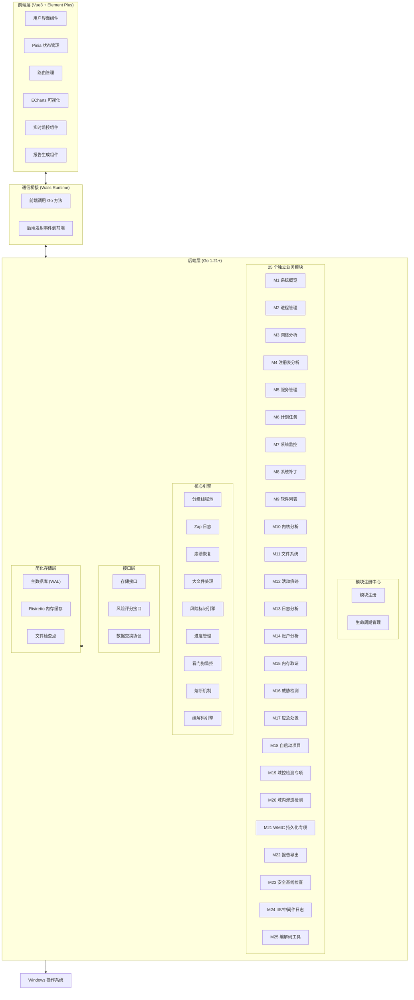
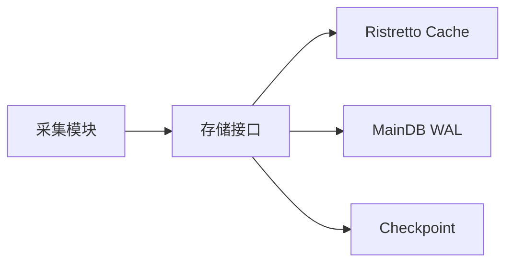

# Windows 应急响应工具 (ERT) 技术设计方案

需求名称：2026-03-25-windows-ert
更新日期：2026-03-25

## 概述

Windows 应急响应工具 (ERT) 是一款基于 Go 语言开发的 Windows 系统应急响应工具，采用 Wails v2 + Vue3 + Element Plus 前后端分离架构，支持 **25 个独立功能模块**。核心数据存储采用 SQLite 简化架构（MainDB + Cache + Checkpoint），默认只读采集，支持可选的安全处置功能。

### 25 个模块概览

| ID | 模块名称 | 核心功能 | 优先级 |
|----|----------|----------|--------|
| M1 | 系统概览 | 主机信息、资源监控、实时图表 | P0 |
| M2 | 进程管理 | 进程列表/树、查杀、Dump | P0 |
| M3 | 网络分析 | 连接列表、端口监听、IP 地理 | P0 |
| M4 | 注册表分析 | 关键项检测、持久化、自启动 | P0 |
| M5 | 服务管理 | 服务列表、启停操作 | P0 |
| M6 | 计划任务 | 任务列表、异常检测 | P0 |
| M7 | 系统监控 | CPU/内存/磁盘/网络实时监控 | P0 |
| M8 | 系统补丁 | 已安装补丁、缺失补丁 | P1 |
| M9 | 软件列表 | 已安装软件、异常检测 | P0 |
| M10 | 内核分析 | 驱动列表、签名状态 | P1 |
| M11 | 文件系统 | 文件枚举、哈希、大文件处理 | P0 |
| M12 | 活动痕迹 | 最近打开、USB使用、浏览器历史 | P0 |
| M13 | 日志分析 | 事件日志、EVTX解析、全文搜索 | P0 |
| M14 | 账户分析 | 本地/域账户、组、权限 | P0 |
| M15 | 内存取证 | 进程/系统内存 Dump | P1 |
| M16 | 威胁检测 | 恶意进程、可疑网络、敏感行为 | P0 |
| M17 | 应急处置 | 进程查杀、文件隔离、审计日志 | P1 |
| M18 | 自启动项目 | 注册表/启动文件夹/服务/WMI | P0 |
| M19 | 域控检测专项 | 域用户/组/OU/GPO、离线降级 | P0 |
| M20 | 域内渗透检测 | Kerberoasting、Golden Ticket | P0 |
| M21 | WMIC 持久化专项 | WMIC 命令历史检测 | P0 |
| M22 | 报告导出 | HTML/PDF/JSON/加密导出 | P0 |
| M23 | 安全基线检查 | 密码/账户/审核/网络安全 | P0 |
| M24 | IIS/中间件日志 | IIS/Apache/SQL Server 日志 | P0 |
| M25 | 编解码工具 | Base64/Hex/Unicode/URL/HTML | P0 |

### 技术栈概览

| 层级 | 技术选型 | 版本 |
|------|----------|------|
| 后端框架 | Wails v2 | v2.7+ |
| 后端语言 | Go | 1.21+ |
| 前端框架 | Vue.js | 3.4+ |
| UI 组件库 | Element Plus | 2.4+ |
| 状态管理 | Pinia | 2.1+ |
| 图表库 | ECharts | 5.4+ |
| 数据库 | SQLite (modernc.org/sqlite 纯 Go) | v1.30+ |
| 缓存 | Ristretto | v0.2.0 |
| 日志 | Zap | v1.27+ |

---

## 架构设计

### 整体架构



### 项目目录结构

```
ert/
├── app/                      # 前端源码 (Vue3)
│   ├── src/
│   │   ├── components/       # 公共 UI 组件
│   │   │   ├── Progress/    # 进度显示组件
│   │   │   ├── RiskTag/     # 风险标记组件
│   │   │   ├── Search/      # 搜索组件
│   │   │   ├── Timeline/    # 攻击时间线组件
│   │   │   ├── Codec/       # 编解码工具组件 (M25)
│   │   │   ├── Compare/     # 会话对比组件
│   │   │   └── Encrypt/     # 加密导出组件
│   │   ├── views/           # 25 个模块独立视图
│   │   ├── stores/          # 25 个独立 Pinia Store
│   │   ├── router/          # 路由配置
│   │   └── shortcuts/       # 快捷键管理
│   └── package.json
├── internal/                 # 后端内部包
│   ├── modules/              # 25 个独立模块
│   │   ├── system/          # M1 系统概览
│   │   ├── process/         # M2 进程管理
│   │   ├── network/         # M3 网络分析
│   │   ├── registry/        # M4 注册表分析
│   │   ├── service/         # M5 服务管理
│   │   ├── schedule/        # M6 计划任务
│   │   ├── monitor/         # M7 系统监控
│   │   ├── patch/           # M8 系统补丁
│   │   ├── software/        # M9 软件列表
│   │   ├── kernel/          # M10 内核分析
│   │   ├── filesystem/      # M11 文件系统
│   │   ├── activity/        # M12 活动痕迹
│   │   ├── logging/         # M13 日志分析
│   │   ├── account/         # M14 账户分析
│   │   ├── memory/          # M15 内存取证
│   │   ├── threat/          # M16 威胁检测
│   │   ├── response/        # M17 应急处置
│   │   ├── autostart/       # M18 自启动项目
│   │   ├── domain/          # M19 域控检测专项
│   │   ├── domainhack/      # M20 域内渗透检测
│   │   ├── wmic/            # M21 WMIC 持久化专项
│   │   ├── report/          # M22 报告导出
│   │   ├── baseline/        # M23 安全基线检查
│   │   ├── iis/             # M24 IIS/中间件日志
│   │   └── codec/           # M25 编解码工具
│   ├── core/                 # 核心引擎
│   │   ├── storage/         # SQLite 存储管理
│   │   ├── cache/           # Ristretto 缓存
│   │   ├── checkpoint/      # 文件检查点
│   │   ├── concurrency/     # 分级线程池
│   │   ├── recovery/        # 崩溃恢复
│   │   ├── watchdog/        # 看门狗监控
│   │   ├── circuit/         # 熔断机制
│   │   ├── risk/            # 风险标记引擎
│   │   ├── progress/        # 进度管理
│   │   ├── timeline/        # 攻击时间线重建
│   │   ├── compare/         # 会话对比
│   │   ├── aging/           # 任务老化机制
│   │   ├── codec/           # 编解码引擎
│   │   └── memory/          # 内存 Dump 引擎
│   ├── startup/             # 启动检测
│   │   ├── webview2/        # WebView2 检测
│   │   └── permission/      # 权限检测
│   ├── registry/             # 模块注册中心
│   ├── interfaces/           # 接口定义
│   ├── dto/                 # 数据交换协议
│   └── model/               # 数据结构
├── config/
│   └── config.yaml          # 中心化配置
├── data/
│   ├── ipdb/                # IP 地理位置库
│   ├── baseline/            # 基线配置
│   └── memory/              # 内存 dump 文件
├── wails.json               # Wails 配置
├── go.mod
└── go.sum
```

---

## 核心引擎设计

### 1. SQLite 简化存储架构

采用 MainDB + Cache + Checkpoint 三库架构，使用 `modernc.org/sqlite` 纯 Go 驱动：



**MainDB (WAL 模式)**
- 使用 modernc.org/sqlite 纯 Go 实现，无 CGO 依赖
- WAL 模式支持并发读写
- 批量写入：减少锁竞争
- 定期 checkpoint：控制 WAL 文件大小

**Ristretto 缓存**
- 高性能内存缓存
- TTL 支持
- LRU 淘汰策略

**Checkpoint**
- 崩溃恢复点
- 原子写入 + 版本号校验
- 会话状态持久化

### 2. 分级并发线程池

```go
type SemaphorePool struct {
    high    semaphore.Weighted  // P0 任务
    medium  semaphore.Weighted  // P1 任务
    low     semaphore.Weighted  // P2 任务
}

type Task struct {
    ID       string
    Priority int
    Handler  func() error
    CreatedAt time.Time
}
```

**优先级调度**
- P0: 系统关键任务 (进程采集、网络分析)
- P1: 一般采集任务 (日志分析、文件枚举)
- P2: 低优先级任务 (基线检查、报告生成)

### 3. 任务老化机制

防止低优先级任务饿死：

```go
type AgingController struct {
    MaxWaitTime   time.Duration
    PriorityBoost int
    CheckInterval time.Duration
}
```

- 等待超过阈值时提升优先级
- 超过最大等待时间强制执行
- 动态调整防止饥饿

### 4. 熔断与看门狗

```go
type CircuitBreaker struct {
    failureThreshold int
    resetTimeout     time.Duration
    state            atomic.Int32
}

type Watchdog struct {
    timeout    time.Duration
    onTimeout  func(taskID string)
}
```

- 连续失败 N 次后暂停任务
- 独立 Goroutine 监控任务执行
- 超时自动取消

### 5. 编解码引擎 (M25)

```go
type CodecEngine struct {
    HistoryDB *sql.DB
    MaxHistory int
    EnableHistory bool  // 默认开启
}

type CodecType string
const (
    CodecBase64     CodecType = "base64"
    CodecBase64URL  CodecType = "base64url"
    CodecHex        CodecType = "hex"
    CodecUnicode    CodecType = "unicode"
    CodecURL        CodecType = "url"
    CodecHTML       CodecType = "html"
    CodecBinary     CodecType = "binary"
)
```

**支持类型**
| 编码类型 | 编码示例 | 解码示例 |
|----------|----------|----------|
| Base64 | `SGVsbG8=` | `Hello` |
| Hex | `48656c6c6f` | `Hello` |
| Unicode | `\u0048\u0065` | `He` |
| URL | `%48%65` | `He` |
| HTML | `&#72;&#101;` | `He` |
| Binary | `01001000` | `H` |

**历史记录特性**
- 历史记录默认开启
- 历史记录存储在 SQLite 数据库
- 支持配置最大历史条数（默认 100 条）
- 支持配置历史保留天数（默认 7 天）
- 不发送任何网络请求
- 处理完成后内存立即清零

**M25 数据库表结构**

```sql
-- 编解码历史记录表
CREATE TABLE codec_history (
    id INTEGER PRIMARY KEY AUTOINCREMENT,
    input TEXT NOT NULL,
    output TEXT NOT NULL,
    codec_type TEXT NOT NULL,
    operation TEXT NOT NULL,
    created_at TEXT NOT NULL
);

CREATE INDEX idx_codec_history_created ON codec_history(created_at);
CREATE INDEX idx_codec_history_type ON codec_history(codec_type);
```

### 6. 内存 Dump 引擎

支持进程和系统内存 dump 用于取证分析：

```go
type MemoryDumper struct {
    outputDir string
    maxSize   uint64
}

type DumpType string
const (
    DumpProcess  DumpType = "process"
    DumpFull     DumpType = "full"
    DumpKernel   DumpType = "kernel"
)

func (m *MemoryDumper) DumpProcess(pid uint32) (string, error)
func (m *MemoryDumper) DumpFull() (string, error)
```

**安全特性**
- 只读采集，不修改系统状态
- 支持分块写入，避免内存溢出
- 记录 dump 过程的审计日志
- 生成 SHA256 哈希校验完整性

---

## 25 个独立模块详细设计

### 模块设计原则

每个模块遵循以下设计原则：
- **职责单一**：每个模块只负责特定的功能领域
- **接口驱动**：模块通过接口与核心引擎交互
- **配置独立**：每个模块有独立的采集配置
- **数据隔离**：模块数据通过 DTO 传输，不直接操作数据库表
- **启动加载**：模块在程序启动时注册，不支持运行时热插拔

### M1 系统概览

**功能定位**：展示主机基本信息和关键指标的总览面板

**核心功能**：
| 功能 | 说明 | 优先级 |
|------|------|--------|
| 主机基本信息 | 计算机名、操作系统版本、当前用户、启动时间 | P0 |
| 系统资源 | CPU 使用率、内存使用率、磁盘使用率 | P0 |
| 网络状态 | 网卡信息、IP 地址、网络连接数 | P0 |
| 运行时间 | 系统运行时间、最后一次启动时间 | P1 |
| 关键进程数 | 进程总数、线程总数、句柄总数 | P1 |
| 实时监控图表 | CPU/内存/磁盘/网络实时曲线图 | P0 |

**数据来源**：
- Windows API: `GetSystemInfo`, `GlobalMemoryStatusEx`
- WMI: `Win32_OperatingSystem`, `Win32_ComputerSystem`
- `github.com/shirou/gopsutil`

**UI 展示**：
- 卡片式布局展示各项指标
- ECharts 实时图表
- 风险状态概览

---

### M2 进程管理

**功能定位**：进程查看、分析、处置

**核心功能**：
| 功能 | 说明 | 优先级 |
|------|------|--------|
| 进程列表 | PID、名称、路径、用户、CPU、内存、启动时间 | P0 |
| 进程树 | 父子进程关系树形展示 | P0 |
| 进程详情 | 命令行、环境变量、加载模块、线程信息 | P1 |
| 进程搜索 | 按名称/PID/路径搜索 | P0 |
| 风险标记 | 无签名标黄，可疑进程标红 | P0 |
| 进程查杀 | 终止进程（需管理员+二次确认） | P1 |
| 进程 Dump | 导出进程内存用于分析 | P1 |

**数据来源**：
- Windows API: `NtQuerySystemInformation`, `EnumProcesses`
- WMI: `Win32_Process`
- `github.com/shirou/gopsutil`

**SQLite 存储**：
```sql
INSERT INTO processes (pid, name, path, command_line, user_name, 
    cpu_percent, memory_bytes, start_time, risk_level, collected_at, session_id)
VALUES (?, ?, ?, ?, ?, ?, ?, ?, ?, ?, ?)
```

**安全机制**：
- 进程查杀需二次确认
- 关键系统进程（lsass.exe, winlogon.exe）禁止查杀
- 所有操作记录审计日志

---

### M3 网络分析

**功能定位**：网络连接查看、异常检测

**核心功能**：
| 功能 | 说明 | 优先级 |
|------|------|--------|
| 连接列表 | 协议、本地地址/端口、远程地址/端口、状态、PID | P0 |
| 监听端口 | 所有监听中的端口及对应进程 | P0 |
| 网络路径 | 路由表、ARP 表 | P1 |
| IP 地理位置 | 显示远程 IP 的地理位置 | P1 |
| 风险检测 | 可疑端口、可疑外部连接 | P0 |
| 连接统计 | 按协议/状态分组统计 | P1 |

**数据来源**：
- Windows API: `GetExtendedTcpTable`, `GetExtendedUdpTable`
- `github.com/shirou/gopsutil`

**SQLite 存储**：
```sql
INSERT INTO network_connections (pid, protocol, local_addr, local_port, 
    remote_addr, remote_port, state, risk_level, collected_at, session_id)
VALUES (?, ?, ?, ?, ?, ?, ?, ?, ?, ?)
```

**IP 库**：
- 使用精简离线 IP 库（<20MB）
- 支持 MaxMind GeoIP2 格式
- 查询 `github.com/oschwald/geoip2-golang`

---

### M4 注册表分析

**功能定位**：注册表关键项检测、持久化分析

**核心功能**：
| 功能 | 说明 | 优先级 |
|------|------|--------|
| 关键项检测 | Run、RunOnce、Services 等关键路径 | P0 |
| 自启动项 | 注册表中的自启动项 | P0 |
| 最近操作 | 最近打开/编辑的注册表项 | P1 |
| 权限分析 | 注册表项的访问权限 | P2 |
| 值类型分析 | 可疑的值类型（如 REG_BINARY 解码） | P1 |
| 注册表搜索 | 按路径/名称/值搜索 | P0 |

**重点检测路径**：
```
HKLM\SOFTWARE\Microsoft\Windows\CurrentVersion\Run
HKLM\SOFTWARE\Microsoft\Windows\CurrentVersion\RunOnce
HKLM\SYSTEM\CurrentControlSet\Services
HKCU\SOFTWARE\Microsoft\Windows\CurrentVersion\Run
HKCU\SOFTWARE\Microsoft\Windows\CurrentVersion\Explorer\RunMRU
```

**数据来源**：
- Windows API: `RegOpenKeyEx`, `RegEnumKeyEx`
- `golang.org/x/sys/windows/registry`

**SQLite 存储**：
```sql
INSERT INTO registry_keys (path, name, value_type, value, 
    modified_time, risk_level, collected_at, session_id)
VALUES (?, ?, ?, ?, ?, ?, ?, ?)
```

---

### M5 服务管理

**功能定位**：Windows 服务查看、分析

**核心功能**：
| 功能 | 说明 | 优先级 |
|------|------|--------|
| 服务列表 | 名称、显示名、状态、启动类型、路径 | P0 |
| 服务详情 | 依赖关系、描述、触发条件 | P1 |
| 风险检测 | 异常服务、禁用安全服务 | P0 |
| 服务搜索 | 按名称/状态/启动类型搜索 | P0 |
| 服务操作 | 启动/停止/重启（需管理员+二次确认） | P1 |

**数据来源**：
- Windows API: `EnumServicesStatusEx`
- WMI: `Win32_Service`
- `github.com/shirou/gopsutil`

**SQLite 存储**：
```sql
INSERT INTO services (name, display_name, status, start_type, 
    path, risk_level, collected_at, session_id)
VALUES (?, ?, ?, ?, ?, ?, ?, ?)
```

---

### M6 计划任务

**功能定位**：计划任务查看、持久化检测

**核心功能**：
| 功能 | 说明 | 优先级 |
|------|------|--------|
| 任务列表 | 任务名称、状态、上次运行、下次运行 | P0 |
| 任务详情 | 操作、触发器、运行条件 | P1 |
| 异常检测 | 隐藏任务、异常路径任务 | P0 |
| 任务操作 | 创建/删除/修改任务（需管理员+二次确认） | P2 |
| XML 导出 | 导出任务配置用于分析 | P1 |

**数据来源**：
- Windows API: `ITaskScheduler`, `IScheduledWorkItem`
- `github.com/go-ole/go-ole` (COM 接口)
- WMI: `Win32_ScheduledTask`

**SQLite 存储**：
```sql
INSERT INTO scheduled_tasks (name, path, state, last_run_time, 
    next_run_time, risk_level, collected_at, session_id)
VALUES (?, ?, ?, ?, ?, ?, ?, ?)
```

---

### M7 系统监控

**功能定位**：实时系统状态监控、告警

**核心功能**：
| 功能 | 说明 | 优先级 |
|------|------|--------|
| CPU 监控 | 使用率实时曲线、历史峰值 | P0 |
| 内存监控 | 使用量/总量、换页率 | P0 |
| 磁盘监控 | 读写速度、空间使用 | P0 |
| 网络监控 | 流量实时曲线 | P0 |
| 进程活动 | 新进程创建、进程退出 | P1 |
| 连接监控 | 新建连接、连接关闭 | P1 |
| 告警规则 | 自定义阈值告警 | P2 |

**实现方式**：
- 独立 Goroutine 定期采集（默认 1 秒间隔）
- 通过 Wails `Emit` 推送实时数据到前端
- ECharts 绑定实时数据流

**配置项**：
```yaml
monitor:
  interval: 1s        # 采集间隔
  history_size: 300    # 历史数据点数量
  alerts:
    cpu_threshold: 90  # CPU 告警阈值
    mem_threshold: 85  # 内存告警阈值
```

---

### M8 系统补丁

**功能定位**：系统补丁查看、漏洞检测

**核心功能**：
| 功能 | 说明 | 优先级 |
|------|------|--------|
| 已安装补丁 | KB 编号、描述、安装日期 | P0 |
| 缺失补丁 | 已知的重要的安全补丁 | P1 |
| 漏洞关联 | 补丁对应的 CVE 漏洞 | P2 |
| 补丁搜索 | 按 KB 编号/日期搜索 | P1 |

**数据来源**：
- WMI: `Win32_QuickFixEngineering`
- Windows API: `QueryHotfix`

**SQLite 存储**：
```sql
CREATE TABLE patches (
    id INTEGER PRIMARY KEY AUTOINCREMENT,
    hotfix_id TEXT NOT NULL,
    description TEXT,
    installed_on TEXT,
    risk_level INTEGER DEFAULT 0,
    collected_at TEXT NOT NULL,
    session_id TEXT NOT NULL
);
```

---

### M9 软件列表

**功能定位**：已安装软件查看、异常检测

**核心功能**：
| 功能 | 说明 | 优先级 |
|------|------|--------|
| 软件列表 | 名称、版本、发布者、安装日期 | P0 |
| 安装位置 | 软件安装路径 | P1 |
| 异常检测 | 可疑软件、无版本软件 | P1 |
| 软件搜索 | 按名称/发布者搜索 | P0 |
| 卸载检测 | 可疑的卸载程序 | P2 |

**数据来源**：
- 注册表: `HKLM\SOFTWARE\Microsoft\Windows\CurrentVersion\Uninstall`
- `github.com/shirou/gopsutil`

**SQLite 存储**：
```sql
CREATE TABLE software (
    id INTEGER PRIMARY KEY AUTOINCREMENT,
    name TEXT NOT NULL,
    version TEXT,
    publisher TEXT,
    install_date TEXT,
    install_location TEXT,
    risk_level INTEGER DEFAULT 0,
    collected_at TEXT NOT NULL,
    session_id TEXT NOT NULL
);
```

---

### M10 内核分析

**功能定位**：内核对象查看（用户态降级）

**核心功能**：
| 功能 | 说明 | 优先级 |
|------|------|--------|
| SSDT 查看 | 系统服务描述符表 | P1 |
| 驱动列表 | 已加载内核驱动 | P0 |
| 驱动签名 | 驱动签名状态 | P0 |
| 异常驱动 | 无签名驱动、签名无效驱动 | P1 |

**数据来源**：
- Windows API: `NtQuerySystemInformation`
- `github.com/shirou/gopsutil`

**说明**：用户态程序无法直接访问内核内存，仅能获取驱动列表和签名状态。深度内核分析需要内核驱动支持。

**SQLite 存储**：
```sql
CREATE TABLE drivers (
    id INTEGER PRIMARY KEY AUTOINCREMENT,
    name TEXT NOT NULL,
    path TEXT,
    base_address TEXT,
    size INTEGER,
    is_signed INTEGER DEFAULT 0,
    signature TEXT,
    risk_level INTEGER DEFAULT 0,
    collected_at TEXT NOT NULL,
    session_id TEXT NOT NULL
);
```

---

### M11 文件系统

**功能定位**：文件分析、取证

**核心功能**：
| 功能 | 说明 | 优先级 |
|------|------|--------|
| 文件枚举 | 目录浏览、文件列表 | P0 |
| 文件详情 | 大小、创建/修改/访问时间、属性 | P0 |
| 文件搜索 | 按名称/大小/日期范围搜索 | P0 |
| 文件哈希 | MD5、SHA1、SHA256 计算 | P0 |
| 可疑文件 | 隐藏文件、系统文件、异常扩展名 | P1 |
| 文件复制 | 复制文件到指定位置（只读） | P1 |
| 大文件处理 | GB 级文件流式读取 | P0 |

**数据来源**：
- Windows API: `FindFirstFile`, `FindNextFile`
- `golang.org/x/sys/windows`

**大文件处理**：
```go
func streamHash(ctx context.Context, filePath string, hasher hash.Hash) error {
    f, err := os.Open(filePath)
    if err != nil {
        return err
    }
    defer f.Close()

    buf := make([]byte, 32*1024)
    for {
        select {
        case <-ctx.Done():
            return ctx.Err()
        default:
            n, err := io.ReadFull(f, buf)
            if n > 0 {
                hasher.Write(buf[:n])
            }
            if err == io.EOF {
                return nil
            }
            if err != nil {
                return err
            }
        }
    }
}
```

---

### M12 活动痕迹

**功能定位**：用户操作痕迹检测

**核心功能**：
| 功能 | 说明 | 优先级 |
|------|------|--------|
| 最近打开 | 最近打开的文档、程序 | P0 |
| USB 使用 | USB 设备使用记录 | P1 |
| 网络浏览 | 浏览器历史记录（Chrome、Firefox、Edge） | P1 |
| 文件操作 | 文件创建、修改、删除记录 | P1 |
| 应用执行 | 应用执行历史 | P0 |
| 回收站 | 回收站内容 | P2 |

**数据来源**：
- 跳转列表: `%APPDATA%\Microsoft\Windows\Recent`
- 注册表: `HKCU\SOFTWARE\Microsoft\Windows\CurrentVersion\Explorer\RunMRU`
- 浏览器数据库: SQLite 读取

**SQLite 存储**：
```sql
CREATE TABLE activity (
    id INTEGER PRIMARY KEY AUTOINCREMENT,
    activity_type TEXT NOT NULL,
    target TEXT NOT NULL,
    timestamp TEXT,
    details TEXT,
    risk_level INTEGER DEFAULT 0,
    collected_at TEXT NOT NULL,
    session_id TEXT NOT NULL
);
```

---

### M13 日志分析

**功能定位**：Windows 事件日志分析

**核心功能**：
| 功能 | 说明 | 优先级 |
|------|------|--------|
| 事件日志 | 安全、系统、应用日志 | P0 |
| 日志筛选 | 按级别/来源/时间/事件ID | P0 |
| 关键词搜索 | 日志内容全文搜索 | P0 |
| 日志导出 | 导出为 JSON/CSV | P1 |
| 告警规则 | 恶意事件关键词告警 | P1 |
| SQL Server 日志 | MSSQL 日志文件分析 | P1 |

**支持格式**：
- EVTX: Windows 事件日志 XML 格式
- ETL: 事件跟踪日志

**数据来源**：
- WMI: `Win32_NtLogEvent`
- `github.com/yusufpapurcu/evtx` (EVTX 解析)

**FTS5 全文索引**：
```sql
INSERT INTO logs_fts (content, source, timestamp, session_id)
VALUES (?, ?, ?, ?)
```

**性能要求**：
- 100MB EVTX < 30 秒
- 1GB EVTX < 5 分钟（流式解析）

---

### M14 账户分析

**功能定位**：用户账户检测、权限分析

**核心功能**：
| 功能 | 说明 | 优先级 |
|------|------|--------|
| 本地账户 | 账户列表、最后登录 | P0 |
| 账户组 | 用户组及成员 | P0 |
| 特殊账户 | Guest、Administrator、隐藏账户 | P0 |
| 账户权限 | 账户权限分配 | P1 |
| 弱密码检测 | 尝试检测空密码/弱密码账户 | P2 |
| SID 分析 | 账户 SID 解析 | P1 |

**数据来源**：
- WMI: `Win32_UserAccount`, `Win32_Group`
- Windows API: `NetUserEnum`, `NetLocalGroupEnum`

**SQLite 存储**：
```sql
CREATE TABLE accounts (
    id INTEGER PRIMARY KEY AUTOINCREMENT,
    name TEXT NOT NULL,
    full_name TEXT,
    sid TEXT,
    domain TEXT,
    status TEXT,
    last_logon TEXT,
    risk_level INTEGER DEFAULT 0,
    collected_at TEXT NOT NULL,
    session_id TEXT NOT NULL
);

CREATE TABLE account_groups (
    id INTEGER PRIMARY KEY AUTOINCREMENT,
    group_name TEXT NOT NULL,
    member_name TEXT NOT NULL,
    collected_at TEXT NOT NULL,
    session_id TEXT NOT NULL
);
```

---

### M15 内存取证

**功能定位**：内存 dump 和分析

**核心功能**：
| 功能 | 说明 | 优先级 |
|------|------|--------|
| 进程内存 Dump | 指定进程内存导出 | P0 |
| 系统内存 Dump | 完整系统内存（需管理员） | P1 |
| Dump 列表 | 历次 Dump 记录 | P0 |
| 完整性校验 | SHA256 哈希校验 | P0 |
| Dump 导出 | 导出到外部存储 | P1 |

**安全机制**：
- 只读采集，不修改系统状态
- 分块写入避免内存溢出
- 记录审计日志

**实现参考**：见"核心引擎设计 - 6. 内存 Dump 引擎"

---

### M16 威胁检测

**功能定位**：基于威胁情报的检测

**核心功能**：
| 功能 | 说明 | 优先级 |
|------|------|--------|
| 恶意进程检测 | 基于哈希的恶意进程检测 | P0 |
| 可疑网络检测 | 恶意 IP/域名连接 | P1 |
| 敏感行为 | 关键注册表修改、关键目录访问 | P0 |
| 威胁情报 | 离线威胁情报库匹配 | P1 |
| 行为分析 | 命令行异常、进程链异常 | P2 |

**本地威胁情报库**：
- 恶意进程哈希库
- 恶意 IP/域名库
- 敏感路径列表

**风险评分**：
```go
func (r *RiskEngine) CalculateScore(process *ProcessDTO) RiskLevel {
    score := 0

    if r.isMaliciousHash(process.Path) {
        score += 50
    }
    if r.isSuspiciousCommandLine(process.CommandLine) {
        score += 30
    }
    if r.isConnectingToMaliciousIP(process) {
        score += 40
    }

    switch {
    case score >= 70:
        return RiskCritical
    case score >= 40:
        return RiskHigh
    case score >= 20:
        return RiskMedium
    default:
        return RiskLow
    }
}
```

---

### M17 应急处置

**功能定位**：安全的处置操作

**核心功能**：
| 功能 | 说明 | 优先级 |
|------|------|--------|
| 进程查杀 | 终止恶意进程 | P0 |
| 文件隔离 | 移动恶意文件到隔离区 | P1 |
| 网络断开 | 断开网络连接 | P2 |
| 服务禁用 | 禁用恶意服务 | P1 |
| 注册表修复 | 恢复被篡改的注册表 | P2 |

**安全机制**：
- **二次确认**：所有操作需要前端弹窗确认
- **审计日志**：记录操作人、时间、对象、结果
- **权限校验**：检查管理员权限
- **关键保护**：禁止查杀系统关键进程
- **备份回滚**：操作前备份，支持回滚

**审计日志**：
```sql
INSERT INTO audit_logs (timestamp, operator, action, target, result, details)
VALUES (?, ?, ?, ?, ?, ?)
```

**配置项**：
```yaml
response:
  require_confirmation: true
  allow_kill_critical: false
  backup_before_action: true
```

---

### M18 自启动项目

**功能定位**：持久化驻留检测

**核心功能**：
| 功能 | 说明 | 优先级 |
|------|------|--------|
| 注册表自启动 | Run、RunOnce 等键值 | P0 |
| 启动文件夹 | 启动目录快捷方式 | P0 |
| 计划任务 | 自启动计划任务 | P0 |
| 服务自启动 | 自启动服务 | P0 |
| WMI 自启动 | WMI Event Subscriber | P1 |
| 驱动自启动 | 自启动内核驱动 | P1 |
| 统一下发 | 整合所有自启动点展示 | P0 |

**风险评估**：
- 路径在临时目录
- 路径包含随机字符
- 无签名或签名异常
- 命令行包含混淆参数

---

### M19 域控检测专项

**功能定位**：Active Directory 检测

**核心功能**：
| 功能 | 说明 | 优先级 |
|------|------|--------|
| 域信息 | 域名称、域控制器 | P0 |
| 域用户 | 域用户列表 | P0 |
| 域组 | 域组及成员 | P0 |
| OU 结构 | 组织单位结构 | P1 |
| GPO | 组策略对象 | P1 |
| 信任关系 | 域信任关系 | P2 |
| 离线降级 | LDAP 不可用时降级为本地分析 | P0 |

**数据来源**：
- LDAP: `github.com/go-ldap/ldap/v3`
- WMI: `Win32_NTDomain`

**离线降级**：
```go
func (d *DomainDetector) Detect() error {
    conn, err := ldap.Dial("tcp", ldapServer)
    if err != nil {
        logger.Warn("LDAP connection failed, falling back to local analysis")
        return d.fallbackToLocal()
    }
    defer conn.Close()
    return d.queryDomainInfo(conn)
}
```

---

### M20 域内渗透检测

**功能定位**：Kerberos 攻击检测

**核心功能**：
| 功能 | 说明 | 优先级 |
|------|------|--------|
| Kerberoasting | SPN 账户请求统计 | P0 |
| AS-REP Roasting | 可疑 AS-REP 响应 | P1 |
| Golden Ticket | TGT 异常检测 | P2 |
| Silver Ticket | ST 异常检测 | P2 |
| 账户异常 | 大量密码错误、账户锁定 | P0 |
| 权限提升 | 敏感组成员变化 | P1 |

**数据来源**：
- 事件日志: Security.evtx (Kerberos 事件)
- LDAP 查询

---

### M21 WMIC 持久化专项

**功能定位**：WMIC 命令历史检测

**核心功能**：
| 功能 | 说明 | 优先级 |
|------|------|--------|
| WMIC 历史 | WMIC 命令执行历史 | P0 |
| 可疑命令 | 创建进程、删除文件等 | P0 |
| 批量检测 | 常见 WMIC 攻击命令 | P1 |
| 命令来源 | 执行来源分析 | P1 |

**检测命令模式**：
```
wmic process call create
wmic /node: process call create
wmic startup list
wmic service list
```

---

### M22 报告导出

**功能定位**：生成分析报告

**核心功能**：
| 功能 | 说明 | 优先级 |
|------|------|--------|
| HTML 报告 | 生成 HTML 格式报告 | P0 |
| PDF 报告 | 生成 PDF 格式报告 | P1 |
| JSON 导出 | 结构化数据导出 | P0 |
| 加密导出 | AES-256-GCM 加密包 | P1 |
| 报告模板 | 自定义报告模板 | P2 |
| 会话对比报告 | 两个会话对比分析报告 | P1 |

**报告内容**：
- 主机基本信息
- 风险摘要
- 进程分析
- 网络连接
- 自启动项
- 日志摘要
- 威胁检测结果
- 攻击时间线

**PDF 生成**：
- jsPDF + html2canvas (前端)
- 支持自定义样式

---

### M23 安全基线检查

**功能定位**：安全配置检测

**核心功能**：
| 功能 | 说明 | 优先级 |
|------|------|--------|
| 密码策略 | 密码复杂度、长度、过期时间 | P0 |
| 账户策略 | 锁定阈值、登录尝试 | P0 |
| 审核策略 | 安全日志审核配置 | P1 |
| 网络安全 | SMB 版本、防火墙状态 | P1 |
| 服务配置 | 不必要的服务 | P1 |
| 基线模板 | 内置安全基线模板 | P0 |

**数据来源**：
- WMI: `Win32_AccountPolicy`
- 注册表: `HKLM\SYSTEM\CurrentControlSet\Services\LanmanServer\Parameters`
- `github.com/hectane/go-acl` (ACL 检查)

**基线配置格式**：
```yaml
baseline:
  password_policy:
    min_length: 8
    complexity: true
    max_age: 90
  lockout_policy:
    threshold: 5
    duration: 30
  audit_policy:
    logon: success,failure
    process_creation: success
```

---

### M24 IIS/中间件日志

**功能定位**：Web 服务器日志分析

**核心功能**：
| 功能 | 说明 | 优先级 |
|------|------|--------|
| IIS 日志 | IIS 日志解析（W3C 格式） | P0 |
| Apache/Nginx | 访问日志解析 | P1 |
| SQL Server 日志 | MSSQL 日志分析 | P1 |
| Tomcat/Jetty | Java 中间件日志 | P2 |
| 日志统计 | 访问量、状态码、IP 统计 | P1 |
| 异常检测 | 大量 404、500 错误 | P1 |
| 攻击检测 | SQL 注入、XSS 尝试 | P1 |

**支持格式**：
- IIS: W3C Extended Log File Format
- Apache: Combined Log Format
- JSON 格式日志

**SQLite 存储**：
```sql
CREATE TABLE web_logs (
    id INTEGER PRIMARY KEY AUTOINCREMENT,
    timestamp TEXT NOT NULL,
    client_ip TEXT,
    method TEXT,
    path TEXT,
    status_code INTEGER,
    user_agent TEXT,
    session_id TEXT NOT NULL
);

CREATE INDEX idx_web_logs_timestamp ON web_logs(timestamp);
CREATE INDEX idx_web_logs_ip ON web_logs(client_ip);
```

---

### M25 编解码工具

**功能定位**：常用编码转换工具

**核心功能**：
| 功能 | 说明 | 优先级 |
|------|------|--------|
| Base64 | 标准/URL 安全 Base64 | P0 |
| Hex | 十六进制转换 | P0 |
| Unicode | Unicode 编码/解码 | P0 |
| URL | URL 编码/解码 | P0 |
| HTML | HTML 实体编码/解码 | P0 |
| Binary | 二进制字符串转换 | P1 |
| 自动检测 | 尝试所有解码器 | P0 |
| 批量转换 | 多个字符串批量处理 | P1 |
| 历史记录 | 转换历史（默认开启） | P0 |
| 字符串提取 | 从二进制数据提取字符串 | P1 |

**实现参考**：见"核心引擎设计 - 5. 编解码引擎"

**历史记录配置**：
```yaml
codec:
  enable_history: true       # 默认开启
  max_history: 100          # 最大条数
  retention_days: 7         # 保留天数
```

---

## 组件与接口

### 模块注册中心

```go
type Module interface {
    Name() string
    ID() int
    Priority() int
    Init(ctx context.Context) error
    Run(ctx context.Context) error
    Stop() error
}

type Registry struct {
    modules map[int]Module
    mu      sync.RWMutex
}

func (r *Registry) Register(m Module) error
func (r *Registry) Get(id int) (Module, error)
func (r *Registry) List() []Module
func (r *Registry) Enable(id int) error
func (r *Registry) Disable(id int) error
```

### 存储接口

```go
type Storage interface {
    Write(ctx context.Context, table string, data interface{}) error
    WriteBatch(ctx context.Context, table string, data interface{}) error
    Read(ctx context.Context, query string, args ...interface{}) (*sql.Rows, error)
    Query(ctx context.Context, query string, args ...interface{}) ([]map[string]interface{}, error)
}

type Cache interface {
    Get(key string) (interface{}, bool)
    Set(key string, value interface{}, ttl time.Duration)
    Delete(key string)
    Clear()
}

type Checkpoint interface {
    Save(state *SessionState) error
    Load() (*SessionState, error)
}
```

### 数据交换协议 (DTO)

```go
type ProcessDTO struct {
    PID         uint32
    Name        string
    Path        string
    CommandLine string
    User        string
    CPU         float64
    Memory      uint64
    StartTime   time.Time
    RiskLevel   RiskLevel
}

type NetworkConnDTO struct {
    PID         uint32
    Protocol    string
    LocalAddr   string
    LocalPort   uint16
    RemoteAddr  string
    RemotePort  uint16
    State       string
    RiskLevel   RiskLevel
}

type RegistryKeyDTO struct {
    Path        string
    Name        string
    ValueType   string
    Value       string
    Modified    time.Time
    RiskLevel   RiskLevel
}

type MemoryDumpDTO struct {
    PID         uint32
    ProcessName string
    DumpType    DumpType
    FilePath    string
    FileSize    uint64
    SHA256      string
    CreatedAt   time.Time
}
```

---

## 数据模型

### SQLite 表结构

```sql
-- 进程表
CREATE TABLE processes (
    id INTEGER PRIMARY KEY AUTOINCREMENT,
    pid INTEGER NOT NULL,
    name TEXT NOT NULL,
    path TEXT,
    command_line TEXT,
    user_name TEXT,
    cpu_percent REAL,
    memory_bytes INTEGER,
    start_time TEXT,
    risk_level INTEGER DEFAULT 0,
    collected_at TEXT NOT NULL,
    session_id TEXT NOT NULL
);

CREATE INDEX idx_processes_pid ON processes(pid);
CREATE INDEX idx_processes_name ON processes(name);
CREATE INDEX idx_processes_risk ON processes(risk_level);

-- 网络连接表
CREATE TABLE network_connections (
    id INTEGER PRIMARY KEY AUTOINCREMENT,
    pid INTEGER,
    protocol TEXT,
    local_addr TEXT,
    local_port INTEGER,
    remote_addr TEXT,
    remote_port INTEGER,
    state TEXT,
    risk_level INTEGER DEFAULT 0,
    collected_at TEXT NOT NULL,
    session_id TEXT NOT NULL
);

-- 注册表表
CREATE TABLE registry_keys (
    id INTEGER PRIMARY KEY AUTOINCREMENT,
    path TEXT NOT NULL,
    name TEXT,
    value_type TEXT,
    value TEXT,
    modified_time TEXT,
    risk_level INTEGER DEFAULT 0,
    collected_at TEXT NOT NULL,
    session_id TEXT NOT NULL
);

-- 服务表
CREATE TABLE services (
    id INTEGER PRIMARY KEY AUTOINCREMENT,
    name TEXT NOT NULL,
    display_name TEXT,
    status TEXT,
    start_type TEXT,
    path TEXT,
    risk_level INTEGER DEFAULT 0,
    collected_at TEXT NOT NULL,
    session_id TEXT NOT NULL
);

-- 计划任务表
CREATE TABLE scheduled_tasks (
    id INTEGER PRIMARY KEY AUTOINCREMENT,
    name TEXT NOT NULL,
    path TEXT,
    state TEXT,
    last_run_time TEXT,
    next_run_time TEXT,
    risk_level INTEGER DEFAULT 0,
    collected_at TEXT NOT NULL,
    session_id TEXT NOT NULL
);

-- 审计日志表
CREATE TABLE audit_logs (
    id INTEGER PRIMARY KEY AUTOINCREMENT,
    timestamp TEXT NOT NULL,
    operator TEXT NOT NULL,
    action TEXT NOT NULL,
    target TEXT NOT NULL,
    result TEXT NOT NULL,
    details TEXT
);

-- 会话表
CREATE TABLE sessions (
    id TEXT PRIMARY KEY,
    hostname TEXT NOT NULL,
    started_at TEXT NOT NULL,
    ended_at TEXT,
    status TEXT NOT NULL
);

-- 检查点表
CREATE TABLE checkpoints (
    id INTEGER PRIMARY KEY AUTOINCREMENT,
    session_id TEXT NOT NULL,
    task_id TEXT NOT NULL,
    state TEXT NOT NULL,
    version INTEGER NOT NULL,
    created_at TEXT NOT NULL,
    FOREIGN KEY (session_id) REFERENCES sessions(id)
);

-- FTS5 全文索引
CREATE VIRTUAL TABLE logs_fts USING fts5(
    content,
    source,
    timestamp,
    session_id
);

-- 内存 Dump 记录表
CREATE TABLE memory_dumps (
    id INTEGER PRIMARY KEY AUTOINCREMENT,
    pid INTEGER,
    process_name TEXT,
    dump_type TEXT NOT NULL,
    file_path TEXT NOT NULL,
    file_size INTEGER,
    sha256 TEXT,
    created_at TEXT NOT NULL,
    session_id TEXT NOT NULL
);

CREATE INDEX idx_memory_dumps_pid ON memory_dumps(pid);
CREATE INDEX idx_memory_dumps_type ON memory_dumps(dump_type);
```

### 风险等级定义

```go
type RiskLevel int
const (
    RiskLow       RiskLevel = 0  // 绿色 - 正常
    RiskMedium    RiskLevel = 1  // 黄色 - 可疑特征
    RiskHigh      RiskLevel = 2  // 红色 - 高风险
    RiskCritical  RiskLevel = 3  // 紫色 - 恶意
)
```

**风险标记规则**
| 条件 | 风险等级 | 颜色 |
|------|----------|------|
| 正常系统进程 | 低 | 绿色 |
| 可疑进程特征（如网络连接异常、命令行混淆） | 中 | 黄色 |
| 高风险进程（如已知恶意进程特征） | 高 | 红色 |
| 确认恶意（基于威胁情报匹配） | 严重 | 紫色 |

---

## 启动检测流程

### WebView2 检测

```go
func CheckWebView2() error {
    // 检测注册表 HKLM\SOFTWARE\WOW6432Node\Microsoft\EdgeUpdate\Clients\{F3017226-FE2A-4295-8BDF-00C3A9A7E4C5}
    // 或 HKLM\SOFTWARE\Microsoft\EdgeUpdate\Clients\{F3017226-FE2A-4295-8BDF-00C3A9A7E4C5}
    
    if !isInstalled {
        if isWindows7() {
            return errors.New("WebView2 未安装，请下载安装后重试")
        }
    }
    return nil
}
```

### 权限检测

```go
func CheckPermissions() error {
    // 检测是否具有管理员权限
    isAdmin, _ := isAdmin()
    if !isAdmin {
        // 仅警告，保留只读功能
        logger.Warn("Not running as administrator, some features will be disabled")
    }
    return nil
}
```

---

## 正确性属性

### 1. 数据完整性
- 原始日志完整打包存档
- 使用 io.Copy 流式复制，不截断
- 写入事务保证原子性

### 2. 操作可追溯性
- 所有处置操作记录审计日志
- 审计日志按天归档加密
- 支持导出校验

### 3. 崩溃恢复
- Checkpoint 持久化任务进度
- 重启后自动读取检查点恢复
- 版本号校验避免脏数据

### 4. 资源保护
- 信号量限制并发 goroutine
- 内存映射 + 流式解析处理大文件
- 正则搜索内存限制 500MB

---

## 错误处理

### 分层错误处理

```go
type ErrorCode int
const (
    ErrSystem      ErrorCode = 1  // 系统级错误
    ErrPermission  ErrorCode = 2  // 权限错误
    ErrNotFound    ErrorCode = 3  // 资源未找到
    ErrTimeout     ErrorCode = 4  // 操作超时
    ErrCancelled   ErrorCode = 5  // 操作取消
    ErrInvalid     ErrorCode = 6  // 参数错误
    ErrIO          ErrorCode = 7  // IO 错误
)
```

### 错误传播

```go
func collectProcesses(ctx context.Context) error {
    defer func() {
        if r := recover(); r != nil {
            logger.Error("panic recovered", "error", r)
        }
    }()
    
    // 使用 context 控制超时
    ctx, cancel := context.WithTimeout(ctx, 30*time.Second)
    defer cancel()
    
    // 执行采集
    return doCollect(ctx)
}
```

### 熔断降级

```go
func (cb *CircuitBreaker) Execute(ctx context.Context, op func() error) error {
    if cb.state.Load() == StateOpen {
        select {
        case <-ctx.Done():
            return ctx.Err()
        case <-time.After(cb.resetTimeout):
            cb.state.Store(StateHalfOpen)
        }
    }
    
    err := op()
    if err != nil {
        cb.onFailure()
        return err
    }
    
    cb.onSuccess()
    return nil
}
```

---

## 测试策略

### 单元测试

```go
func TestCodecEngine_Base64(t *testing.T) {
    engine := NewCodecEngine()
    
    // 编码测试
    encoded, err := engine.Encode("Hello", CodecBase64)
    assert.NoError(t, err)
    assert.Equal(t, "SGVsbG8=", encoded)
    
    // 解码测试
    decoded, err := engine.Decode("SGVsbG8=", CodecBase64)
    assert.NoError(t, err)
    assert.Equal(t, "Hello", decoded)
}

func TestCodecEngine_AutoDetect(t *testing.T) {
    engine := NewCodecEngine()
    results := engine.AutoDetect("SGVsbG8=")
    
    assert.NotEmpty(t, results)
    assert.Equal(t, "Base64", results[0].Type)
}
```

### 集成测试

- Windows 7/10/11/Server 全版本测试
- VM 自动化测试脚本
- SQLite WAL 模式并发测试

### 性能测试

| 指标 | 目标 | 测试方法 |
|------|------|----------|
| 启动时间 | < 3s | 冷启动计时 |
| 日志解析 | 100MB < 30s | go test -bench |
| 大文件 | 1GB < 5min | 流式解析测试 |
| 搜索 | 百万级 < 1s | FTS5 索引测试 |

### 安全测试

- 静态代码分析: golangci-lint, gosec
- 内存清零验证
- M25 历史记录功能验证

---

## 编译与打包

### 编译命令

```bash
# 纯 Go 版本 (默认，无 CGO 依赖)
go build -ldflags="-s -w -H=windowsgui -trimpath -buildvcs=false"
```

> 使用 modernc.org/sqlite 纯 Go 数据库驱动，无需 CGO 即可编译运行。

### Wails 打包

```bash
# 开发模式
wails dev

# 生产构建
wails build

# 可选 UPX 压缩
upx --best ert.exe
```

---

## 引用链接

[^1]: Wails v2 官方文档 - https://wails.io/docs/v2/
[^2]: Go 1.21 标准库 - https://pkg.go.dev/std
[^3]: Element Plus 组件库 - https://element-plus.org/
[^4]: modernc.org/sqlite 纯 Go 数据库 - https://modernc.org/sqlite/
[^5]: Ristretto 缓存 - https://github.com/dgraph-io/ristretto
[^6]: Zap 日志库 - https://github.com/uber-go/zap
