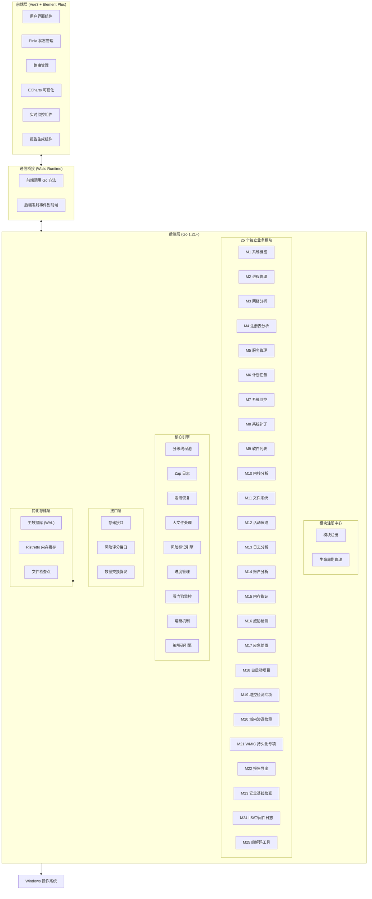
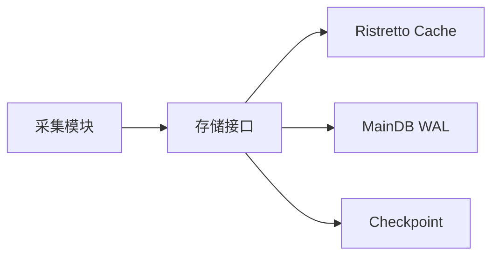

# Windows 应急响应工具 (ERT) 技术设计方案

需求名称：2026-03-25-windows-ert
更新日期：2026-03-25

## 概述

Windows 应急响应工具 (ERT) 是一款基于 Go 语言开发的 Windows 系统应急响应工具，采用 Wails v2 + Vue3 + Element Plus 前后端分离架构，支持 25 个独立功能模块。核心数据存储采用 SQLite 简化架构（MainDB + Cache + Checkpoint），默认只读采集，支持可选的安全处置功能。

### 技术栈概览

| 层级 | 技术选型 | 版本 |
|------|----------|------|
| 后端框架 | Wails v2 | v2.7+ |
| 后端语言 | Go | 1.21+ |
| 前端框架 | Vue.js | 3.4+ |
| UI 组件库 | Element Plus | 2.4+ |
| 状态管理 | Pinia | 2.1+ |
| 图表库 | ECharts | 5.4+ |
| 数据库 | SQLite (modernc.org/sqlite 纯 Go) | v1.30+ |
| 缓存 | Ristretto | v0.2.0 |
| 日志 | Zap | v1.27+ |

---

## 架构设计

### 整体架构



### 项目目录结构

```
ert/
├── app/                      # 前端源码 (Vue3)
│   ├── src/
│   │   ├── components/       # 公共 UI 组件
│   │   │   ├── Progress/    # 进度显示组件
│   │   │   ├── RiskTag/     # 风险标记组件
│   │   │   ├── Search/      # 搜索组件
│   │   │   ├── Timeline/    # 攻击时间线组件
│   │   │   ├── Codec/       # 编解码工具组件 (M25)
│   │   │   ├── Compare/     # 会话对比组件
│   │   │   └── Encrypt/     # 加密导出组件
│   │   ├── views/           # 25 个模块独立视图
│   │   ├── stores/          # 25 个独立 Pinia Store
│   │   ├── router/          # 路由配置
│   │   └── shortcuts/       # 快捷键管理
│   └── package.json
├── internal/                 # 后端内部包
│   ├── modules/              # 25 个独立模块
│   │   ├── system/          # M1 系统概览
│   │   ├── process/         # M2 进程管理
│   │   ├── network/         # M3 网络分析
│   │   ├── registry/        # M4 注册表分析
│   │   ├── service/         # M5 服务管理
│   │   ├── schedule/        # M6 计划任务
│   │   ├── monitor/         # M7 系统监控
│   │   ├── patch/           # M8 系统补丁
│   │   ├── software/        # M9 软件列表
│   │   ├── kernel/          # M10 内核分析
│   │   ├── filesystem/      # M11 文件系统
│   │   ├── activity/        # M12 活动痕迹
│   │   ├── logging/         # M13 日志分析
│   │   ├── account/         # M14 账户分析
│   │   ├── memory/          # M15 内存取证
│   │   ├── threat/          # M16 威胁检测
│   │   ├── response/        # M17 应急处置
│   │   ├── autostart/       # M18 自启动项目
│   │   ├── domain/          # M19 域控检测专项
│   │   ├── domainhack/      # M20 域内渗透检测
│   │   ├── wmic/            # M21 WMIC 持久化专项
│   │   ├── report/          # M22 报告导出
│   │   ├── baseline/        # M23 安全基线检查
│   │   ├── iis/             # M24 IIS/中间件日志
│   │   └── codec/           # M25 编解码工具
│   ├── core/                 # 核心引擎
│   │   ├── storage/         # SQLite 存储管理
│   │   ├── cache/           # Ristretto 缓存
│   │   ├── checkpoint/      # 文件检查点
│   │   ├── concurrency/     # 分级线程池
│   │   ├── recovery/        # 崩溃恢复
│   │   ├── watchdog/        # 看门狗监控
│   │   ├── circuit/         # 熔断机制
│   │   ├── risk/            # 风险标记引擎
│   │   ├── progress/        # 进度管理
│   │   ├── timeline/        # 攻击时间线重建
│   │   ├── compare/         # 会话对比
│   │   ├── aging/           # 任务老化机制
│   │   ├── codec/           # 编解码引擎
│   │   └── memory/          # 内存 Dump 引擎
│   ├── startup/             # 启动检测
│   │   ├── webview2/        # WebView2 检测
│   │   └── permission/      # 权限检测
│   ├── registry/             # 模块注册中心
│   ├── interfaces/           # 接口定义
│   ├── dto/                 # 数据交换协议
│   └── model/               # 数据结构
├── config/
│   └── config.yaml          # 中心化配置
├── data/
│   ├── ipdb/                # IP 地理位置库
│   ├── baseline/            # 基线配置
│   └── memory/              # 内存 dump 文件
├── wails.json               # Wails 配置
├── go.mod
└── go.sum
```

---

## 核心引擎设计

### 1. SQLite 简化存储架构

采用 MainDB + Cache + Checkpoint 三库架构，使用 `modernc.org/sqlite` 纯 Go 驱动：



**MainDB (WAL 模式)**
- 使用 modernc.org/sqlite 纯 Go 实现，无 CGO 依赖
- WAL 模式支持并发读写
- 批量写入：减少锁竞争
- 定期 checkpoint：控制 WAL 文件大小

**Ristretto 缓存**
- 高性能内存缓存
- TTL 支持
- LRU 淘汰策略

**Checkpoint**
- 崩溃恢复点
- 原子写入 + 版本号校验
- 会话状态持久化

### 2. 分级并发线程池

```go
type SemaphorePool struct {
    high    semaphore.Weighted  // P0 任务
    medium  semaphore.Weighted  // P1 任务
    low     semaphore.Weighted  // P2 任务
}

type Task struct {
    ID       string
    Priority int
    Handler  func() error
    CreatedAt time.Time
}
```

**优先级调度**
- P0: 系统关键任务 (进程采集、网络分析)
- P1: 一般采集任务 (日志分析、文件枚举)
- P2: 低优先级任务 (基线检查、报告生成)

### 3. 任务老化机制

防止低优先级任务饿死：

```go
type AgingController struct {
    MaxWaitTime   time.Duration
    PriorityBoost int
    CheckInterval time.Duration
}
```

- 等待超过阈值时提升优先级
- 超过最大等待时间强制执行
- 动态调整防止饥饿

### 4. 熔断与看门狗

```go
type CircuitBreaker struct {
    failureThreshold int
    resetTimeout     time.Duration
    state            atomic.Int32
}

type Watchdog struct {
    timeout    time.Duration
    onTimeout  func(taskID string)
}
```

- 连续失败 N 次后暂停任务
- 独立 Goroutine 监控任务执行
- 超时自动取消

### 5. 编解码引擎 (M25)

```go
type CodecEngine struct {
    HistoryDB *sql.DB
    MaxHistory int
    EnableHistory bool  // 默认开启
}

type CodecType string
const (
    CodecBase64     CodecType = "base64"
    CodecBase64URL  CodecType = "base64url"
    CodecHex        CodecType = "hex"
    CodecUnicode    CodecType = "unicode"
    CodecURL        CodecType = "url"
    CodecHTML       CodecType = "html"
    CodecBinary     CodecType = "binary"
)
```

**支持类型**
| 编码类型 | 编码示例 | 解码示例 |
|----------|----------|----------|
| Base64 | `SGVsbG8=` | `Hello` |
| Hex | `48656c6c6f` | `Hello` |
| Unicode | `\u0048\u0065` | `He` |
| URL | `%48%65` | `He` |
| HTML | `&#72;&#101;` | `He` |
| Binary | `01001000` | `H` |

**历史记录特性**
- 历史记录默认开启
- 历史记录存储在 SQLite 数据库
- 支持配置最大历史条数（默认 100 条）
- 支持配置历史保留天数（默认 7 天）
- 不发送任何网络请求
- 处理完成后内存立即清零

**M25 数据库表结构**

```sql
-- 编解码历史记录表
CREATE TABLE codec_history (
    id INTEGER PRIMARY KEY AUTOINCREMENT,
    input TEXT NOT NULL,
    output TEXT NOT NULL,
    codec_type TEXT NOT NULL,
    operation TEXT NOT NULL,
    created_at TEXT NOT NULL
);

CREATE INDEX idx_codec_history_created ON codec_history(created_at);
CREATE INDEX idx_codec_history_type ON codec_history(codec_type);
```

### 6. 内存 Dump 引擎

支持进程和系统内存 dump 用于取证分析：

```go
type MemoryDumper struct {
    outputDir string
    maxSize   uint64
}

type DumpType string
const (
    DumpProcess  DumpType = "process"
    DumpFull     DumpType = "full"
    DumpKernel   DumpType = "kernel"
)

func (m *MemoryDumper) DumpProcess(pid uint32) (string, error)
func (m *MemoryDumper) DumpFull() (string, error)
```

**安全特性**
- 只读采集，不修改系统状态
- 支持分块写入，避免内存溢出
- 记录 dump 过程的审计日志
- 生成 SHA256 哈希校验完整性

---

## 组件与接口

### 模块注册中心

```go
type Module interface {
    Name() string
    ID() int
    Priority() int
    Init(ctx context.Context) error
    Run(ctx context.Context) error
    Stop() error
}

type Registry struct {
    modules map[int]Module
    mu      sync.RWMutex
}

func (r *Registry) Register(m Module) error
func (r *Registry) Get(id int) (Module, error)
func (r *Registry) List() []Module
func (r *Registry) Enable(id int) error
func (r *Registry) Disable(id int) error
```

### 存储接口

```go
type Storage interface {
    Write(ctx context.Context, table string, data interface{}) error
    WriteBatch(ctx context.Context, table string, data interface{}) error
    Read(ctx context.Context, query string, args ...interface{}) (*sql.Rows, error)
    Query(ctx context.Context, query string, args ...interface{}) ([]map[string]interface{}, error)
}

type Cache interface {
    Get(key string) (interface{}, bool)
    Set(key string, value interface{}, ttl time.Duration)
    Delete(key string)
    Clear()
}

type Checkpoint interface {
    Save(state *SessionState) error
    Load() (*SessionState, error)
}
```

### 数据交换协议 (DTO)

```go
type ProcessDTO struct {
    PID         uint32
    Name        string
    Path        string
    CommandLine string
    User        string
    CPU         float64
    Memory      uint64
    StartTime   time.Time
    RiskLevel   RiskLevel
}

type NetworkConnDTO struct {
    PID         uint32
    Protocol    string
    LocalAddr   string
    LocalPort   uint16
    RemoteAddr  string
    RemotePort  uint16
    State       string
    RiskLevel   RiskLevel
}

type RegistryKeyDTO struct {
    Path        string
    Name        string
    ValueType   string
    Value       string
    Modified    time.Time
    RiskLevel   RiskLevel
}

type MemoryDumpDTO struct {
    PID         uint32
    ProcessName string
    DumpType    DumpType
    FilePath    string
    FileSize    uint64
    SHA256      string
    CreatedAt   time.Time
}
```

---

## 数据模型

### SQLite 表结构

```sql
-- 进程表
CREATE TABLE processes (
    id INTEGER PRIMARY KEY AUTOINCREMENT,
    pid INTEGER NOT NULL,
    name TEXT NOT NULL,
    path TEXT,
    command_line TEXT,
    user_name TEXT,
    cpu_percent REAL,
    memory_bytes INTEGER,
    start_time TEXT,
    risk_level INTEGER DEFAULT 0,
    collected_at TEXT NOT NULL,
    session_id TEXT NOT NULL
);

CREATE INDEX idx_processes_pid ON processes(pid);
CREATE INDEX idx_processes_name ON processes(name);
CREATE INDEX idx_processes_risk ON processes(risk_level);

-- 网络连接表
CREATE TABLE network_connections (
    id INTEGER PRIMARY KEY AUTOINCREMENT,
    pid INTEGER,
    protocol TEXT,
    local_addr TEXT,
    local_port INTEGER,
    remote_addr TEXT,
    remote_port INTEGER,
    state TEXT,
    risk_level INTEGER DEFAULT 0,
    collected_at TEXT NOT NULL,
    session_id TEXT NOT NULL
);

-- 注册表表
CREATE TABLE registry_keys (
    id INTEGER PRIMARY KEY AUTOINCREMENT,
    path TEXT NOT NULL,
    name TEXT,
    value_type TEXT,
    value TEXT,
    modified_time TEXT,
    risk_level INTEGER DEFAULT 0,
    collected_at TEXT NOT NULL,
    session_id TEXT NOT NULL
);

-- 服务表
CREATE TABLE services (
    id INTEGER PRIMARY KEY AUTOINCREMENT,
    name TEXT NOT NULL,
    display_name TEXT,
    status TEXT,
    start_type TEXT,
    path TEXT,
    risk_level INTEGER DEFAULT 0,
    collected_at TEXT NOT NULL,
    session_id TEXT NOT NULL
);

-- 计划任务表
CREATE TABLE scheduled_tasks (
    id INTEGER PRIMARY KEY AUTOINCREMENT,
    name TEXT NOT NULL,
    path TEXT,
    state TEXT,
    last_run_time TEXT,
    next_run_time TEXT,
    risk_level INTEGER DEFAULT 0,
    collected_at TEXT NOT NULL,
    session_id TEXT NOT NULL
);

-- 审计日志表
CREATE TABLE audit_logs (
    id INTEGER PRIMARY KEY AUTOINCREMENT,
    timestamp TEXT NOT NULL,
    operator TEXT NOT NULL,
    action TEXT NOT NULL,
    target TEXT NOT NULL,
    result TEXT NOT NULL,
    details TEXT
);

-- 会话表
CREATE TABLE sessions (
    id TEXT PRIMARY KEY,
    hostname TEXT NOT NULL,
    started_at TEXT NOT NULL,
    ended_at TEXT,
    status TEXT NOT NULL
);

-- 检查点表
CREATE TABLE checkpoints (
    id INTEGER PRIMARY KEY AUTOINCREMENT,
    session_id TEXT NOT NULL,
    task_id TEXT NOT NULL,
    state TEXT NOT NULL,
    version INTEGER NOT NULL,
    created_at TEXT NOT NULL,
    FOREIGN KEY (session_id) REFERENCES sessions(id)
);

-- FTS5 全文索引
CREATE VIRTUAL TABLE logs_fts USING fts5(
    content,
    source,
    timestamp,
    session_id
);

-- 内存 Dump 记录表
CREATE TABLE memory_dumps (
    id INTEGER PRIMARY KEY AUTOINCREMENT,
    pid INTEGER,
    process_name TEXT,
    dump_type TEXT NOT NULL,
    file_path TEXT NOT NULL,
    file_size INTEGER,
    sha256 TEXT,
    created_at TEXT NOT NULL,
    session_id TEXT NOT NULL
);

CREATE INDEX idx_memory_dumps_pid ON memory_dumps(pid);
CREATE INDEX idx_memory_dumps_type ON memory_dumps(dump_type);
```

### 风险等级定义

```go
type RiskLevel int
const (
    RiskLow       RiskLevel = 0  // 绿色 - 正常
    RiskMedium    RiskLevel = 1  // 黄色 - 可疑特征
    RiskHigh      RiskLevel = 2  // 红色 - 高风险
    RiskCritical  RiskLevel = 3  // 紫色 - 恶意
)
```

**风险标记规则**
| 条件 | 风险等级 | 颜色 |
|------|----------|------|
| 正常系统进程 | 低 | 绿色 |
| 可疑进程特征（如网络连接异常、命令行混淆） | 中 | 黄色 |
| 高风险进程（如已知恶意进程特征） | 高 | 红色 |
| 确认恶意（基于威胁情报匹配） | 严重 | 紫色 |

---

## 启动检测流程

### WebView2 检测

```go
func CheckWebView2() error {
    // 检测注册表 HKLM\SOFTWARE\WOW6432Node\Microsoft\EdgeUpdate\Clients\{F3017226-FE2A-4295-8BDF-00C3A9A7E4C5}
    // 或 HKLM\SOFTWARE\Microsoft\EdgeUpdate\Clients\{F3017226-FE2A-4295-8BDF-00C3A9A7E4C5}
    
    if !isInstalled {
        if isWindows7() {
            return errors.New("WebView2 未安装，请下载安装后重试")
        }
    }
    return nil
}
```

### 权限检测

```go
func CheckPermissions() error {
    // 检测是否具有管理员权限
    isAdmin, _ := isAdmin()
    if !isAdmin {
        // 仅警告，保留只读功能
        logger.Warn("Not running as administrator, some features will be disabled")
    }
    return nil
}
```

---

## 正确性属性

### 1. 数据完整性
- 原始日志完整打包存档
- 使用 io.Copy 流式复制，不截断
- 写入事务保证原子性

### 2. 操作可追溯性
- 所有处置操作记录审计日志
- 审计日志按天归档加密
- 支持导出校验

### 3. 崩溃恢复
- Checkpoint 持久化任务进度
- 重启后自动读取检查点恢复
- 版本号校验避免脏数据

### 4. 资源保护
- 信号量限制并发 goroutine
- 内存映射 + 流式解析处理大文件
- 正则搜索内存限制 500MB

---

## 错误处理

### 分层错误处理

```go
type ErrorCode int
const (
    ErrSystem      ErrorCode = 1  // 系统级错误
    ErrPermission  ErrorCode = 2  // 权限错误
    ErrNotFound    ErrorCode = 3  // 资源未找到
    ErrTimeout     ErrorCode = 4  // 操作超时
    ErrCancelled   ErrorCode = 5  // 操作取消
    ErrInvalid     ErrorCode = 6  // 参数错误
    ErrIO          ErrorCode = 7  // IO 错误
)
```

### 错误传播

```go
func collectProcesses(ctx context.Context) error {
    defer func() {
        if r := recover(); r != nil {
            logger.Error("panic recovered", "error", r)
        }
    }()
    
    // 使用 context 控制超时
    ctx, cancel := context.WithTimeout(ctx, 30*time.Second)
    defer cancel()
    
    // 执行采集
    return doCollect(ctx)
}
```

### 熔断降级

```go
func (cb *CircuitBreaker) Execute(ctx context.Context, op func() error) error {
    if cb.state.Load() == StateOpen {
        select {
        case <-ctx.Done():
            return ctx.Err()
        case <-time.After(cb.resetTimeout):
            cb.state.Store(StateHalfOpen)
        }
    }
    
    err := op()
    if err != nil {
        cb.onFailure()
        return err
    }
    
    cb.onSuccess()
    return nil
}
```

---

## 测试策略

### 单元测试

```go
func TestCodecEngine_Base64(t *testing.T) {
    engine := NewCodecEngine()
    
    // 编码测试
    encoded, err := engine.Encode("Hello", CodecBase64)
    assert.NoError(t, err)
    assert.Equal(t, "SGVsbG8=", encoded)
    
    // 解码测试
    decoded, err := engine.Decode("SGVsbG8=", CodecBase64)
    assert.NoError(t, err)
    assert.Equal(t, "Hello", decoded)
}

func TestCodecEngine_AutoDetect(t *testing.T) {
    engine := NewCodecEngine()
    results := engine.AutoDetect("SGVsbG8=")
    
    assert.NotEmpty(t, results)
    assert.Equal(t, "Base64", results[0].Type)
}
```

### 集成测试

- Windows 7/10/11/Server 全版本测试
- VM 自动化测试脚本
- SQLite WAL 模式并发测试

### 性能测试

| 指标 | 目标 | 测试方法 |
|------|------|----------|
| 启动时间 | < 3s | 冷启动计时 |
| 日志解析 | 100MB < 30s | go test -bench |
| 大文件 | 1GB < 5min | 流式解析测试 |
| 搜索 | 百万级 < 1s | FTS5 索引测试 |

### 安全测试

- 静态代码分析: golangci-lint, gosec
- 内存清零验证
- M25 历史记录功能验证

---

## 编译与打包

### 编译命令

```bash
# 纯 Go 版本 (默认，无 CGO 依赖)
go build -ldflags="-s -w -H=windowsgui -trimpath -buildvcs=false"
```

> 使用 modernc.org/sqlite 纯 Go 数据库驱动，无需 CGO 即可编译运行。

### Wails 打包

```bash
# 开发模式
wails dev

# 生产构建
wails build

# 可选 UPX 压缩
upx --best ert.exe
```

---

## 引用链接

[^1]: Wails v2 官方文档 - https://wails.io/docs/v2/
[^2]: Go 1.21 标准库 - https://pkg.go.dev/std
[^3]: Element Plus 组件库 - https://element-plus.org/
[^4]: modernc.org/sqlite 纯 Go 数据库 - https://modernc.org/sqlite/
[^5]: Ristretto 缓存 - https://github.com/dgraph-io/ristretto
[^6]: Zap 日志库 - https://github.com/uber-go/zap
